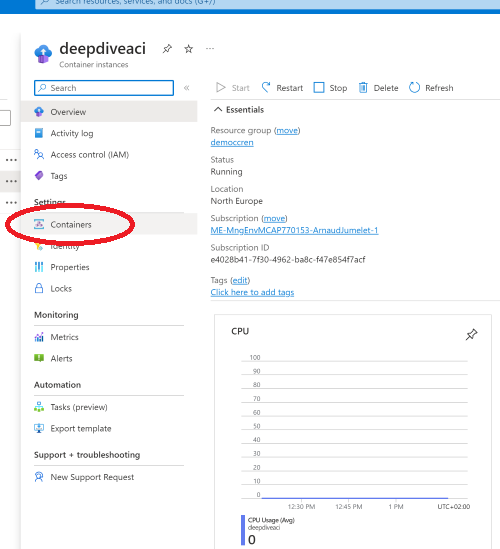
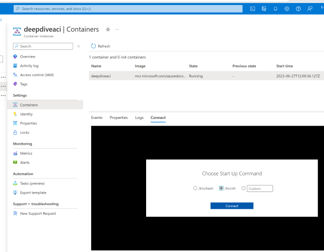

## Confidential containers attestation report validation

Welcome to this comprehensive guide on generating an attestation report, storing it in an Azure Container Instance (ACI), and then verifying it locally. This process is an essential part of ensuring the security of Confidential Containers. The guide utilizes tools and libraries from two GitHub repositories: [Confidential-sidecar-containers](https://github.com/microsoft/confidential-sidecar-containers) for generating the attestation report, and [virtee/snpguest](https://github.com/virtee/snpguest) for verifying it.


### Step 1: Setting up the environment

Navigate to your ACI container :



Connect to your container with bin/sh



Firstly, ensure that all the necessary software is installed on your system.

```bash
apk update && \
apk add git gcc make libc-dev python3 py-pip curl linux-headers python3-dev libffi-dev vim && \
pip3 install --upgrade pip && \
pip3 install azure-cli
```

This command performs the following:

-   `apk update`: Updates the package list in the Alpine Linux's package manager.
-   `apk add ...`: Installs necessary packages including Git, GCC, Make, libc-dev, Python3, pip, curl, Linux headers, Python3 development files, libffi-dev, and Vim text editor.
-   `pip3 install --upgrade pip`: Updates pip, Python's package manager, to the latest version.
-   `pip3 install az-cli`: Installs Azure CLI, the command-line tool for managing Azure resources.
### Step 2: Cloning the Repository

Clone the confidential-sidecar-containers repository from GitHub and navigate into the appropriate directory.

```bash
git clone https://github.com/microsoft/confidential-sidecar-containers
cd confidential-sidecar-containers/tools/get-snp-report/
make
cd bin
```
### Step 3: Generating the Attestation Report

Generate an attestation report using the `get-snp-report` script

```bash
./get-snp-report | xxd -r -p - attestation_report.bin
```
### Step 4: Uploading the Attestation Report to Azure Storage

Upload the attestation report to an Azure Storage blob.

```bash
az storage blob upload --account-name mystorageaccount --account-key myaccountkey --container-name mycontainer --name myblob --type block --file ./attestation_report.bin --output none
```

## The following steps with be performed on an other environment (WSL Ubuntu-20.04)

### Step 5: Downloading the Attestation Report from Azure Storage


```bash
az login
```

Install and configure NTP:
If NTP is not active, you can install and start it with these commands:

```bash
sudo apt install ntp && sudo service ntp start
````


Replace the following resources name with your own

```bash
az storage blob download --account-name mystorageaccount --account-key myaccountkey --container-name mycontainer --name myblob --file ./attestation_report.bin --output none
```
### Step 6: Cloning the snpguest Repository

```bash
git clone https://github.com/virtee/snpguest && cd snpguest
```

### Step 7: Building the snpguest Tool

First we are going to install rust

```bash
curl --proto '=https' --tlsv1.2 -sSf https://sh.rustup.rs | sh
```
```bash
echo 'source $HOME/.cargo/env' >> $HOME/.bashrc
```


```bash
source $HOME/.cargo/env
rustc --version
```
Output:

rustc 1.70.0 (90c541806 2023-05-31)


##### Build the snpguest tool using cargo.

```bash
cargo build -r
cd target/release
```
### Step 8: Preparing the Environment for Verification


Please replace the attestation_report.bin file (downloaded in step 5) and directory paths according to your specific situation.

```bash
mkdir certs
cp <your_attestation_report.bin_file_path> .
```
### Step 9: Fetching the Required Certificates

```bash
./snpguest fetch ca milan certs && ./snpguest fetch vcek milan certs
```

### Step 10: Verifying the Certificates
```bash
./snpguest verify certs certs/
```

The AMD ARK was self-signed! 


The AMD ASK was signed by the AMD ARK! 


The VCEK was signed by the AMD ASK!


### Step 11: Verifying the TCB

```bash
./snpguest verify tcb certs/ -a attestation_report.bin 
```

Output:

Reported TCB Boot Loader from certificate matches the attestation report.


Reported TCB TEE from certificate matches the attestation report.


Reported TCB SNP from certificate matches the attestation report.


Reported TCB Microcode from certificate matches the attestation report.


Chip ID from certificate matches the attestation report.


### Step 12: Verifying the Signature
```bash
./snpguest verify signature certs/ -a attestation_report.bin 
```

Output:

VCEK signed the Attestation Report!