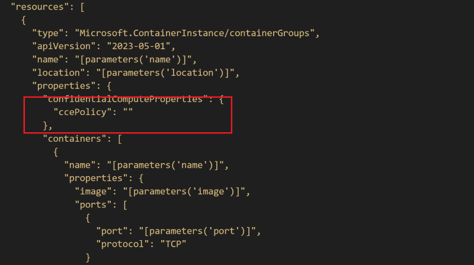
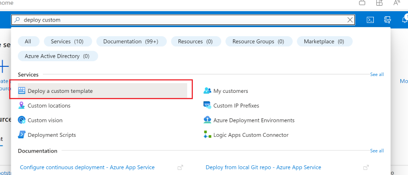
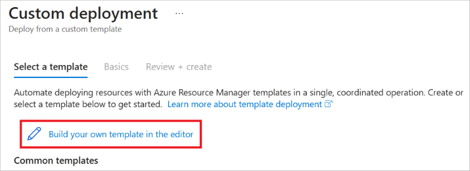
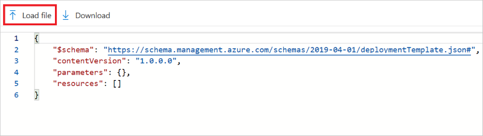
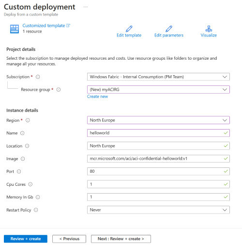
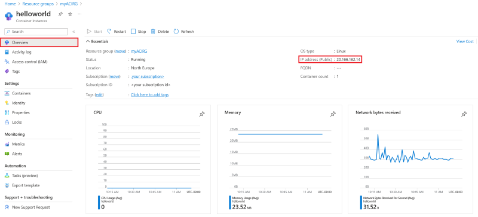

# Confidential container deployment with custom CCE policy (Confidential Computing Enforcement) 


Welcome to this comprehensive demo guide on deploying a Confidential Container on Azure with a custom Confidential Computing Enforcement (CCE) policy. Throughout this guide, you will be taken through the process of creating a confidential container on Azure, using an attestation token to verify the confidential computing environment. Furthermore, you'll learn how to encode a CCE policy as an SHA-256 digest, generate this policy using the Azure CLI confcom extension, and finally incorporate this policy in the container deployment process. This demonstration serves to give you a practical, hands-on experience with Confidential Containers and Confidential Computing Enforcement.

It is worth mentioning that the material presented here is largely inspired by the resources available at the GitHub repository for Azure Confidential Computing [(https://github.com/Azure/confidential-computing-cvm-guest-attestation)](https://learn.microsoft.com/en-us/azure/container-instances/container-instances-tutorial-deploy-confidential-containers-cce-arm
). This guide leverages that content, and you can refer to this resource to delve deeper.


### REQUIREMENTS 

- **Azure CLI**: You should have Azure CLI version 2.44.1 or later installed on your local computer. Run `az --version` to check the version. If you need to install or upgrade, visit [Install the Azure CLI](https://learn.microsoft.com/en-us/cli/azure/install-azure-cli).

- **Azure CLI confcom extension**: You should have the Azure CLI confcom extension version 0.2.13 or later installed to generate confidential computing enforcement policies.

#### TO DO: INSTALL REQUIREMENTS
Install the az confcom extension by using the following command:

```bash
az extension add -n confcom
```

- Use your preferred text editor to save the following ARM template on your local machine as `template.json`.

## Azure Deployment Template

- This is an Azure Deployment Template. It provides parameters to specify a confidential computing environment.
- Save the file as `template.json`.


## JSON Content

```json
{
    "$schema": "https://schema.management.azure.com/schemas/2019-04-01/deploymentTemplate.json#",
    "contentVersion": "1.0.0.0",
    "parameters": {
        "name": {
            "type": "string",
            "defaultValue": "helloworld",
            "metadata": {
                "description": "Name for the container group"
            }
        },
        "location": {
            "type": "string",
            "defaultValue": "North Europe",
            "metadata": {
                "description": "Location for all resources."
            }
        },
        "image": {
            "type": "string",
            "defaultValue": "mcr.microsoft.com/aci/aci-confidential-helloworld:v1",
            "metadata": {
                "description": "Container image to deploy. Should be of the form repoName/imagename:tag for images stored in public Docker Hub, or a fully qualified URI for other registries. Images from private registries require additional registry credentials."
            }
        },
        "port": {
            "type": "int",
            "defaultValue": 80,
            "metadata": {
                "description": "Port to open on the container and the public IP address."
            }
        },
        "cpuCores": {
            "type": "int",
            "defaultValue": 1,
            "metadata": {
                "description": "The number of CPU cores to allocate to the container."
            }
        },
        "memoryInGb": {
            "type": "int",
            "defaultValue": 1,
            "metadata": {
                "description": "The amount of memory to allocate to the container in gigabytes."
            }
        },
        "restartPolicy": {
            "type": "string",
            "defaultValue": "Never",
            "allowedValues": [
                "Always",
                "Never",
                "OnFailure"
            ],
            "metadata": {
                "description": "The behavior of Azure runtime if container has stopped."
            }
        }
    },
    "resources": [
        {
            "type": "Microsoft.ContainerInstance/containerGroups",
            "apiVersion": "2023-05-01",
            "name": "[parameters('name')]",
            "location": "[parameters('location')]",
            "properties": {
                "confidentialComputeProperties": {
                    "ccePolicy": ""
                },
                "containers": [
                    {
                        "name": "[parameters('name')]",
                        "properties": {
                            "image": "[parameters('image')]",
                            "ports": [
                                {
                                    "port": "[parameters('port')]",
                                    "protocol": "TCP"
                                }
                            ],
                            "resources": {
                                "requests": {
                                    "cpu": "[parameters('cpuCores')]",
                                    "memoryInGB": "[parameters('memoryInGb')]"
                                }
                            }
                        }
                    }
                ],
                "sku": "Confidential",
                "osType": "Linux",
                "restartPolicy": "[parameters('restartPolicy')]",
                "ipAddress": {
                    "type": "Public",
                    "ports": [
                        {
                            "port": "[parameters('port')]",
                            "protocol": "TCP"
                        }
                    ]
                }
            }
        }
    ],
    "outputs": {
        "containerIPv4Address": {
            "type": "string",
            "value": "[reference(resourceId('Microsoft.ContainerInstance/containerGroups', parameters('name'))).ipAddress.ip]"
        }
    }
}
```

- To generate the CCE policy, run the following command using the ARM template as input:
  
```bash
az confcom acipolicygen -a ./template.json --print-policy
```

- Upon completion of this command, a Base64 string should be generated as output. This string represents the **CCE policy**. Copy and paste this string into your ARM template under the `ccePolicy` property.

<kbd>

</kbd>

- Log in to Azure and navigate to **Deploy a custom template**.
  
<kbd>

</kbd>

- Select **Build your own template in the editor**. You will then see a mostly blank JSON template.


<kbd>

</kbd>

- Select **Load file** and upload `template.json`, which you've modified by adding the CCE policy generated in the previous steps.

<kbd>

</kbd>

- Click **Save**.

- Select or enter the following values:

   - **Subscription**: Choose an Azure subscription.

   - **Resource Group**: Click on "Create new", provide a unique name for the resource group, then click **OK**.

   - **Location**: Choose a location for the resource group. For example: North Europe.

   - **Name**: Either accept the auto-generated name for the instance or input your preferred name.

   - **Image**: Use the default image name. Note that this sample Linux image displays a hardware attestation.

- For the remaining properties, accept the default values.

- Review the terms and conditions. If you agree with them, select **I agree to the terms and conditions stated above**.

<kbd>

</kbd>

- Navigate to the portal and search for "Container Instances". From the resulting list, select the container instance that you've created.

- Once you're on the "Overview" page, take note of the instance's status and its IP address.

- Once the status of the instance changes to "Running", copy and paste the IP address into your browser's address bar and hit enter.

  
<kbd>

</kbd>

<kbd>

</kbd>
