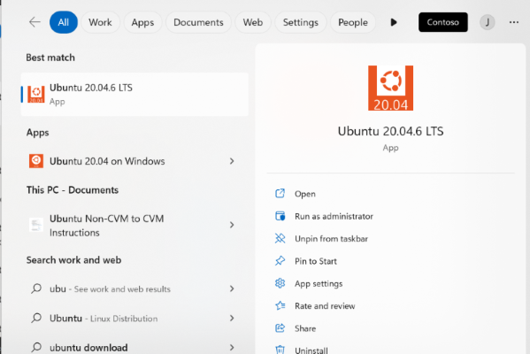
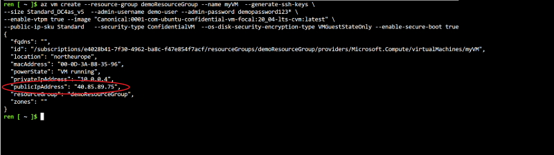
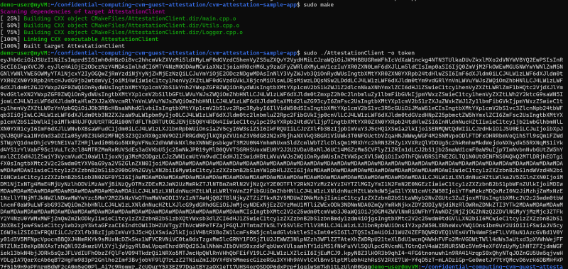

# Demo: Confidential VM and Attestation

Welcome to this comprehensive demo guide on deploying a Confidential VM on Azure and attesting its secure configuration. Throughout this guide, you will be taken through the process of creating a confidential virtual machine (VM) on Azure, leveraging unique security features like Virtual Trusted Platform Module (vTPM) and Secure Boot. Furthermore, you will connect to this VM, install the necessary packages, and build a sample application to request an attestation. This demonstration serves to give you a practical, hands-on experience with the Confidential VM and Attestation process. 

It is worth mentioning that the material presented here is largely inspired by the resources available at https://github.com/Azure/confidential-computing-cvm-guest-attestation.
This lab leverages that content, and you can refer to this resource to delve deeper.

## Deploying a Confidential VM on Azure

- Open the Cloud Shell Bash at [https://shell.azure.com/](https://shell.azure.com/).

- Use the following command to create a new resource group:


```bash
az group create --name demoResourceGroup --location northeurope
```

- Replace in the following command "your_username" and "your_password" then paste it into cloud shell

```bash
az vm create --resource-group demoResourceGroup --name myVM  --generate-ssh-keys \
--size Standard_DC4as_v5  --admin-username <your_username> --admin-password <your_password> \
--enable-vtpm true --image "Canonical:0001-com-ubuntu-confidential-vm-focal:20_04-lts-cvm:latest" \
--public-ip-sku Standard   --security-type ConfidentialVM  --os-disk-security-encryption-type VMGuestStateOnly --enable-secure-boot true
```
This process creates a confidential VM in the **demoResourceGroup** using an Ubuntu-20.04-LTS image. It enables vTPM and Secure Boot.

- Once the VM has been created, we will request an attestation from it.

- Open WSL with Ubuntu-20.04 LTS.

  
<kbd>

</kbd>


### Connection to the VM

<kbd>

</kbd>


- Obtain the VM's public IP address and then connect to it.


```bash
ssh demo-user@<your_vm_public_ip_address>
```
- **Install the following packages:** These are necessary for compiling the sample application.

  
```bash
sudo apt update && sudo apt-get install build-essential && sudo apt-get install libcurl4-openssl-dev && sudo apt-get install libjsoncpp-dev && sudo apt-get install libboost-all-dev && sudo apt install nlohmann-json3-dev && wget https://packages.microsoft.com/repos/azurecore/pool/main/a/azguestattestation1/azguestattestation1_1.0.2_amd64.deb && sudo dpkg -i azguestattestation1_1.0.2_amd64.deb
```
- After the aforementioned packages are installed, follow the steps below to build and run the app:

```bash
git clone https://github.com/Azure/confidential-computing-cvm-guest-attestation.git && cd confidential-computing-cvm-guest-attestation/cvm-attestation-sample-app && sudo apt install cmake && sudo apt install g++ && sudo cmake . && sudo make 
```

## Now we can run the app
  
```bash
sudo ./AttestationClient -o token
```

</kbd>
