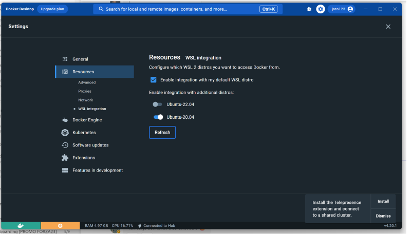

# REQUIREMENTS INSTALLATION

Requires an Azure subscription. Free trial accounts don't have access to the VMs used in this tutorial. One option is to use a pay as you go subscription.

## AZURE CLI INSTALLATION

To install the Azure CLI using PowerShell, start PowerShell as administrator and run the following command:

```powershell
$ProgressPreference = 'SilentlyContinue'; Invoke-WebRequest -Uri https://aka.ms/installazurecliwindows -OutFile .\AzureCLI.msi; Start-Process msiexec.exe -Wait -ArgumentList '/I AzureCLI.msi /quiet'; Remove-Item .\AzureCLI.msi; az upgrade
```
## WSL INSTALLATION

Open windows powershell as administrator

Install WSL Ubuntu-20.04 LTS

```bash
wsl --install -d ubuntu-20.04
```

## NSTALL DOCKER

**Step 1**: Sign up for a Docker account Start by creating a Docker ID : [https://hub.docker.com/signup/](https://hub.docker.com/signup/)

A Docker ID grants you access to Docker Hub repositories and allows you to explore images that are available from the community and verified publishers. You’ll also need a Docker ID to share images on Docker Hub.

**Step 2**: Create your first repository

Sign in to Docker Hub. Select Create a Repository on the Docker Hub welcome page.

-   Name it /my-private-repo.
-   Set the visibility to Private.
-   Select Create.

You’ve created your first repository.

Download docker desktop : [https://www.docker.com/products/docker-desktop/](https://www.docker.com/products/docker-desktop/)

Launch Docker Desktop

Open settings => Go to resources => enable WSL integration with Ubuntu-20.04



## INSTALL VISUAL STUDIO

Install Visual Studio Code : [https://code.visualstudio.com/docs/?dv=win](https://code.visualstudio.com/docs/?dv=win)

Install python, version must be >= 3.8 : [https://marketplace.visualstudio.com/items?itemName=ms-python.python](https://marketplace.visualstudio.com/items?itemName=ms-python.python)