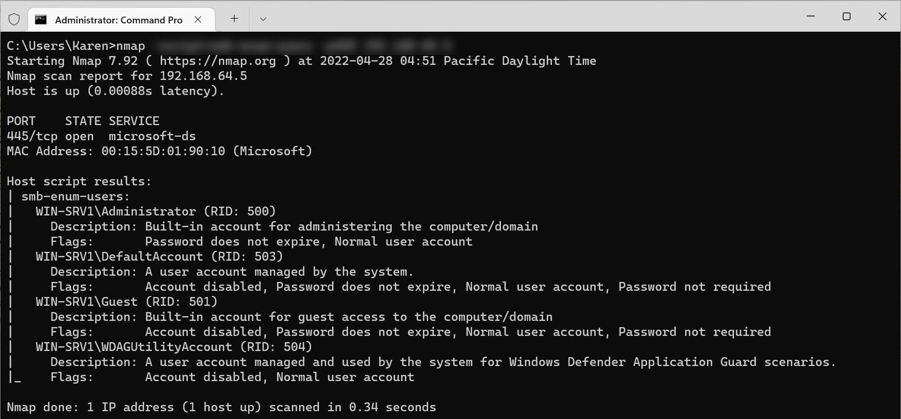
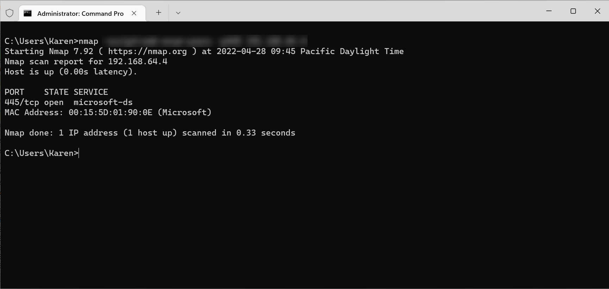
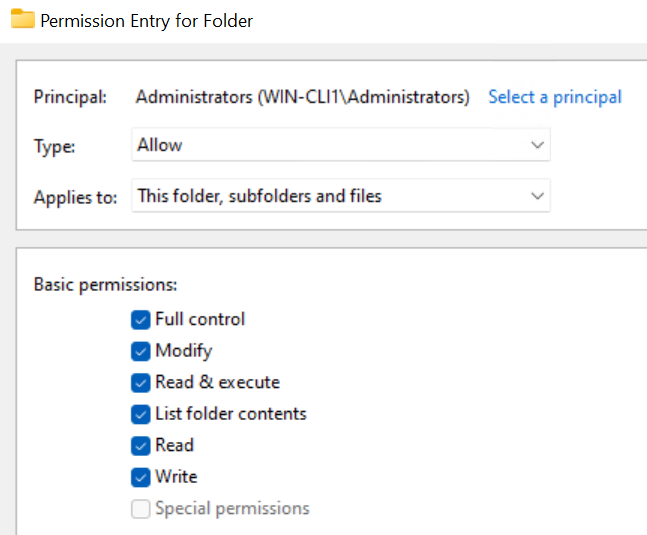
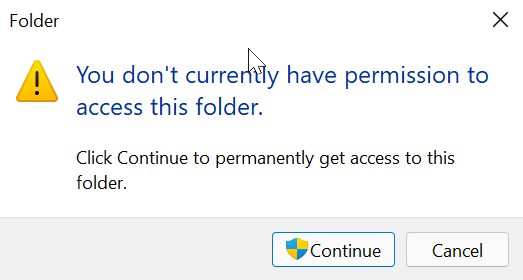
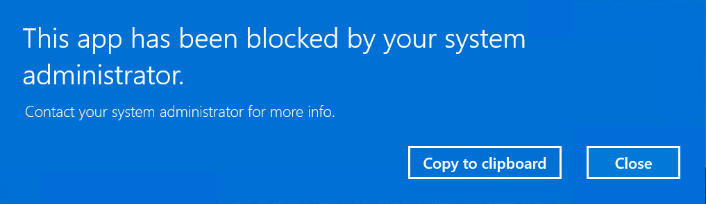
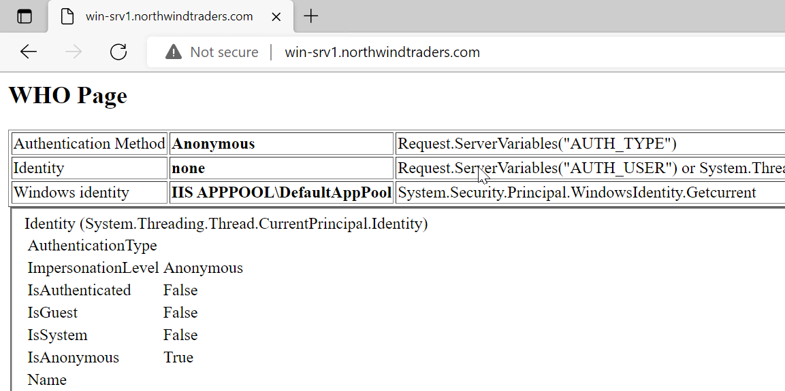
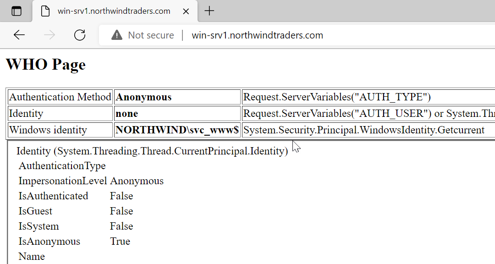

<!-- TOC -->
# LAB1 - Authentication Services
## Abstract and learning objectives  

This training is designed to make you practice the concepts learned in the lectures. 

Learning objectives: 

- Controlling anonymous enumeration of SAM accounts
- Usage of authentication APIs 
- Understanding UAC 
- Usage of gMSA 

## Overview 

This lab is a very simple environment consisting in a Windows 11 client and Windows Server 2022 servers. Both are members of an Active Directory domain northwindtraders.com. The server provides different services to support lab exercises. 

>[!ALERT] **DISCLAIMER**   
- Unless otherwise noted, the example companies, organizations, products, domain names, e-mail addresses, logos, people, places, and events depicted herein are fictitious, and no association with any real company, organization, product, domain name, e-mail address, logo, person, place or event is intended or should be inferred. Complying with all applicable copyright laws is the responsibility of the user. Without limiting the rights under copyright, no part of this document may be reproduced, stored in or introduced into a retrieval system, or transmitted in any form or by any means (electronic, mechanical, photocopying, recording, or otherwise), or for any purpose, without the express written permission of Microsoft Corporation.   
- Microsoft may have patents, patent applications, trademarks, copyrights, or other intellectual property rights covering subject matter in this document. Except as expressly provided in any written license agreement from Microsoft, the furnishing of this document does not give you any license to these patents, trademarks, copyrights, or other intellectual property.
- The names of manufacturers, products, or URLs are provided for informational purposes only and Microsoft makes no representations and warranties, either expressed, implied, or statutory, regarding these manufacturers or the use of the products with any Microsoft technologies. The inclusion of a manufacturer or product does not imply endorsement of Microsoft of the manufacturer or product. Links may be provided to third party sites. Such sites are not under the control of Microsoft and Microsoft is not responsible for the contents of any linked site or any link contained in a linked site, or any changes or updates to such sites. Microsoft is not responsible for webcasting or any other form of transmission received from any linked site. Microsoft is providing these links to you only as a convenience, and the inclusion of any link does not imply endorsement of Microsoft of the site or the products contained therein.

© 2022 Microsoft Corporation. All rights reserved.

Microsoft and the trademarks listed at <https://www.microsoft.com/en-us/legal/intellectualproperty/Trademarks/Usage/General.aspx> are trademarks of the Microsoft group of companies. All other trademarks are property of their respective owners.

===

## Exercise 1: Prevent anonymous enumeration of accounts 

Duration: 30 minutes 

Synopsis: In this exercise, you will learn how to assess the configuration of remote SAM accounts database. Then, you will learn how to properly configure it to prevent anonymous enumeration of accounts. 

In this lab, you will be using the Nmap tool. Nmap is popular in the pen testing community because of its network discovery capabilities. It also contains a script designed to perform anonymous remote enumeration of SAM databases. In the lab, the security configuration of the SAM database has voluntarily been lowered on the DC and member server so that you can observe what happens in an insecure environment. 

Because the SAM has different access control logic on domain controllers and domain member machines, you will perform the assessment both on the lab DC and server. 

- Server: `win-srv1.northwindtraders.com` or IP address = `192.168.1.5`
- DC: `win-dc1.northwindtraders.com` or IP address = `192.168.1.4`

### Task 1: Assess the existing 

In this task, you will assess the current configuration of the SAM database  

1. []Sign in **@lab.VirtualMachine(WIN-CLI1).SelectLink** with following credentials:  
Username: **+++WIN-CLI1\karen+++**  
Password: Please type the password 

1. []Once the session is ready, open a command prompt ‘as administrator’. This can be achieved in two ways:

1. []Right-click the **Start** menu and select **Windows Terminal (Admin)**.

1. []Open the **Start** menu, type **Terminal**, right click on the **Terminal** tile and select **Run as Administrator**.

1. []Using NMap documentation of the smb-enum-users script, prepare the command which will enumerate SAM accounts on server **WIN-SRV1**.

	> [!help]NMap documentation is located here:
    > [https://nmap.org/nsedoc/scripts/smb-enum-users.html](https://nmap.org/nsedoc/scripts/smb-enum-users.html)  
    > NMap is already installed in your environment. You can run your nmap command in the terminal directly.

1. []Launch **Wireshark** as administrator and start a network capture using this filter:   
	tcp port 445   

1. []Run the nmap command for both the member server and the DC 

1. []Stop the network capture 

After performing these steps, you should obtain an output like this in the terminal. 


Nmap uses its own implementation of the SMB protocol to query the SAM RPC endpoints. We are not using the identity of the currently connected user. 
You can observe that the command successfully enumerates the accounts present in the SAM database of targeted servers. But it also displays account’s attributes like account-disabled flag or password-does-not-expire. 

Looking at the network capture, we are interested in the frames with a protocol labeled as **SAMR**. You can filter the network trace by just entering the string **samr** (case sensitive).

---

**Evaluation** 

1. What nmap commands did you use to perform the enumeration?

	Command to use is `nmap -script=smb-enum-users -p445 hostname_or_IP`
	with:
	* _hostname_or_IP_ : name or IP address of the machine under test.

1. Using the network capture filtered on the **SAMR** frames, list the SAM remote procedures used by NMap to perform the enumeration.

	>[!hint]
	SAMR API is documented here:  
	[https://learn.microsoft.com/en-us/openspecs/windows_protocols/ms-samr/3f15814e-4600-4647-abfd-3890f5f3570c](https://learn.microsoft.com/en-us/openspecs/windows_protocols/ms-samr/3f15814e-4600-4647-abfd-3890f5f3570c)

	Based on the network capture and public SAM API documentation, the list of SAM calls is:
	- Connect4
	- EnumDomains
	- LookupDomains
	- OpenDomain
	- QueryDisplayInfo
	- Close

---

You have completed the first task in this exercise. Let’s move on to the remediation. 

===

### Task 2: Remediate weak SAM remote configuration 

In this task, you will be learning how to prevent remote anonymous access to the SAM database. For the purpose of the lab, a weak security configuration has been previously applied to all machines in the northwindtraders.com domain. For simplicity, the configuration was done in the Default Domain Policy group policy. 

Sign in **@lab.VirtualMachine(WIN-DC1).SelectLink** with following credentials   
	Username: **+++NORTHWIND\Administrator+++**   
	Password: Please type the password

Open the _Default Domain Policy_:

1. []From **Server Manager**, open the **Tools** menu in the top right corner 

1. []Select **Group Policy Management** from the drop-down menu 

1. []In **Group Policy Management console**, expand the following node: **Group Policy Management, Forest: northwindtraders.com, Domains, northwindtraders.com** 

1. []Right click **Default Domain Policy** node and select **Edit** 

1. []Using the course material and public documentation, implement the follwing security requirements:

	- Prevent the SAM and LSASS lookup service from answering anonymous requests.
	- Prevent anonymous connections to be granted the ‘Everyone’ pseudo-group.
	- We want to prevent anonymous connections from opening a named pipe. 

	>[!hint]
	>All settings are in:  
	>Default Domain Policy \ Computer Configuration \ Policies \ Windows Settings \ Security Settings \ Local Policies \ Security Options
	>
	>Documentation of the security options is located at:  
	>[https://docs.microsoft.com/en-us/windows/security/threat-protection/security-policy-settings/security-options](https://docs.microsoft.com/en-us/windows/security/threat-protection/security-policy-settings/security-options)

**Case of domain controllers**: 

As explained in the corresponding lecture, SAM storage on domain controllers is achieved by Active Directory database. The same applies to security. Parts of the SAM permission system are handled by underlying ADDS database and corresponding object permission. If you carefully read the documentation for _Network access: Do not allow anonymous enumeration of SAM accounts_, you can quote this important remark: “This policy has no impact on domain controllers.” 

The ADDS object which corresponds to the SAM server is  
**CN=Server,CN=System,DC=northwindtraders,DC=com** 

The usual way anonymous sessions are allowed on domain controllers is because the pseudo-user ‘Anonymous Logon’ is member of the Pre-Windows 2000 Compatible Access built-in group. This is what we need to fix now. 

1. []From **Server Manager**, open the **Tools** menu in the top right corner

1. []Select **Active Directory Users and Computers** from the drop-down menu   

1. []In **Active Directory Users and Computers** console, expand the following node: **Active Directory Users and Computers, northwindtraders.com, Builtin.**   

1. []Double click **Pre-Windows 2000 Compatible Access** group and select **Members** tab   

1. []Remove the entry for **ANONYMOUS LOGON**. Click **Apply**, then **OK**. 

---

**Evaluation**

1. What settings did you apply to fix the vulnerable environment? List all changes you performed on the configuration. Then, for each parameter, explain why you defined it.

	There is no order for configuring the policy but, for clarity, the lab starts the remediation from the upper layer (LSASS and SAM services) down to the named pipe layer. 

	All settings are in Default Domain Policy \ Computer Configuration \ Policies \ Windows Settings \ Security Settings \Local Policies \ Security Options 

	**SAM and LSASS layer** 

	We want to prevent the SAM and LSASS lookup service from answering anonymous requests. We define the following setting. 

	**Setting**: Network access: Restrict clients allowed to make remote calls to SAM   
		**Value**: O:BAG:BAD:(A;;RC;;;BA)   
	> [!hint] _This can be achieved by clicking Edit Security and by removing the entry for Anonymous Logon_ 

	**Setting**: Network access: Do not allow anonymous enumeration of SAM accounts 
		Value: Enabled 

	**Setting**: Network access: Allow anonymous SID/name translation 
		Value: Disabled 

	**RPC / permissions layer** 

	LSASS sets the DACL for the RPC endpoint with an ACE for ‘Everyone’. We don’t want anonymous connections to be granted the ‘Everyone’ pseudo-group. Access to the RPC endpoint won’t be allowed as the ACE won’t match anymore. 

	**Setting**: Network access: Let Everyone permissions apply to anonymous users 
		**Value**: Disabled 

	**Named Pipes layer** 

	We want to prevent anonymous connections from opening a named pipe. 

	**Setting**: Network access: Restrict anonymous access to Named Pipes and Shares 
		**Value**: Enabled 

	**Setting**: Network access: Named pipes that can be accessed anonymously   
		**Value**: _Empty the list 
	> [!hint] In this example, we are taking the most paranoid settings here, not accounting for potential side effects. 

---

===

### Task 3: Assess remediated configuration

In this task, you will test if your configuration still allows anonymous enumeration of SAM accounts. 

1. []Reboot server **@lab.VirtualMachine(WIN-SRV1).SelectLink** and **@lab.VirtualMachine(WIN-DC1).SelectLink** to ensure new configuration is used. 

1. []Start a network capture using Wireshark. Set a capture filter equals to:   
	`tcp port 445`  

1. []Using the same commands as in the first task, ensure anonymous enumeration of users for both DC and member server is not possible 

1. []Stop the network capture 

You should obtain a result like what is pictured below for both server and DC. 


---

**Evaluation**

1. Using the network capture, explain how the server is now refusing anonymous enumeration of SAM accounts.

	Checking the network capture, you can observe that the connection to the **samr** named pipe was denied. That is the result of emptying the value for _Network access: Named pipes that can be accessed anonymously_ 

---

You have completed this exercise. Congratulations!

===
 
## Exercise 2: Fill-in-the-gaps – code a simplified whoami utility 

Duration: 1 hours and 30 minutes

Synopsis: In this exercise, you will write a utility which mimics some of the features of the whoami.exe command. This is a fill-in-the-gap exercise. You start from a working code project where some parts of the code were removed. Your task is to write the missing parts. 

The sample program you’re working on opens the primary token of the process and lists the groups present in the token. It then displays the SID and name of each group. 

### Task 1: Open the project

1. []Sign in **@lab.VirtualMachine(WIN-CLI1).SelectLink** with following credentials   
	- Username: **+++NORTHWIND\david+++**  
	- Password: Please type the password

1. []In the `C:\Lab\WinSecLab` folder, open the WinSecLab.sln file. 

1. []VisualStudio 2022 will prompt you to sign in with your credentials. If you don't want to sign in VisualStudio, just select **Not now, maybe later**. 

1. []In the next screen, VisualStudio will ask you to select an environment. Select **Visual C++** in the list and click on **Start Visual Studio**. 

1. []In the **Solution Explorer** panel, located at the right of the screen, expand the **Solution ‘WinSecLab’ \ 01_whoami \ Source File** nodes and double-click on **whoami.cpp**. 

---

**Evaluation**

There is no evaluation for this task. Move on to the next task to start filling the gaps. 

---

===

### Task 2: Fill missing code parts

#### Program outline
This is the basic outline of the program. Highlighted steps need fixing.
- Get a handle to the current process
- <mark>Open the process's token</mark>
- Get the list of groups from the token
- For each group in the token:
	- Get a text representation of the SID
	- <mark>Perform SID->name translation</mark>
	- Display SID string and translated name on the console

#### API documentation
Throughout this exercise, you will have to use these APIs to fix the code:  
[OpenProcessToken()](https://docs.microsoft.com/en-us/windows/win32/api/processthreadsapi/nf-processthreadsapi-openprocesstoken), [LookupAccountSidW()](https://docs.microsoft.com/en-us/windows/win32/api/winbase/nf-winbase-lookupaccountsidw),

>[!help] These are public APIs from the Windows SDK. Link is provided for convenience. Should the link be broken, just search for the API name using your favorite search engine.

#### Fix1: Get a handle to the current process

**<u>What to fix</u>**
- Function **main()**, steps noted 2.

**<u>Functional description</u>**  
Step 2. in the main() function opens a handle to the process's token.

**<u>Variables to use</u>** 
```C
	HANDLE	hMyToken;		// Handle to the token
	HANDLE	hThisProcess;   // Handle to the process
```

#### Fix2: Perform SID->name translation

**<u>What to fix</u>**
- Function **main()**, steps noted 4.3.

**<u>Functional description</u>**  
Step 4.3. in the main() function translates the SID of one of the groups listed in `pTokenGroups` and stores the result in `wszName` and `wszDomain`.

**<u>Variables to use</u>** 
```C
    TOKEN_GROUPS*   pTokenGroups;       	// TOKEN_GROUPS structure which receives groups list
    WCHAR           wszName[MAX_NAME];      // Temporary buffer to store the name part for the SID 
    WCHAR           wszDomain[MAX_NAME];    // Temporary buffer to store the domain part for the SID 
    DWORD           dwNameSize = 0;         // Stores the size of the name in wszName 
    DWORD           dwDomainSize = 0;       // Stores the size of the domain in wszDomain 
    SID_NAME_USE    sidType;                // SID type enum. 
```

---

**Evaluation**

1. Attach the whoami.cpp file with your answer sheet.

	_Code for step 2._

	```c
	// 2. Open the process's token
    API_CHECK_SUCCESS(OpenProcessToken(
        hThisProcess,
        TOKEN_QUERY,
        &hMyToken));
	```

	_Code for step 4.3._

	```c
	// 4.3 calls LookupAccountSidW to perform SID->name translation
	if (LookupAccountSidW(
		NULL,
		pTokenGroups->Groups[i].Sid,
		wszName,
		&dwNameSize,
		wszDomain,
		&dwDomainSize,
		&sidType
	))
	```

---

### Task 3: Run your program 

If you filled in the blanks correctly, you should be able to compile your program (CTRL-B or **Build** menu \ **Build 01_whoami**) and run it. 

You can run it from Visual Studio by hitting **F5** or **Debug** menu \ **Start Debugging**

You should obtain an output like 


---

**Evaluation**

There is no evaluation for this task.

---

Congratulations, you’ve just completed exercise 2. 

===
 
## Exercise 3: Observe the effects of UAC 

Duration: 15 minutes 

Synopsis: In this exercise, you will observe the effects of UAC in different scenarios. 

The environment is initially set up with the default settings for UAC. 

### Task 1: Token of administrator accounts

In this task, you will observe the effect of UAC on the initial access token. 

1. []Sign in **@lab.VirtualMachine(WIN-CLI1).SelectLink** with following credentials:  
Username: **+++WIN-CLI1\karen+++**  
Password: Please type the password 

1. []Right-click the **Start** menu and select **Windows Terminal** 

1. []Run the following commands:

	```
	whoami /all 
	```

---

**Evaluation**

1. Using only the `whoami` output, how can you tell if the current user is the built-in Administrator account?

	>[!hint]It is not the account's name. The built-in Administrator account can be renamed.

	The built-in Administrator account has a fixed RID which is 500. Any domain SID ending with "-500" is the built-in Administrator account.

1. Is the current user the built-in Administrator account?

	From the command output, you can observe the user’s SID is not the built-in Administrator SID because it does not end with “-500”

1. From the `whoami` output, what is the meaning of the "Group used for deny only" attribute for the BUILTIN\Administrators alias?

	That means the presence of the group in the access token can only participate in “Deny”-type permissions.

---

### Task 2: Effect on permissions evaluation 

In this task, you will observe the effect of the restricted token on permission evaluation. 

Create a folder only BUILTIN\Administrators should have access to:
1. []From the file explorer, create a folder in the **C:**\ drive. For instance, C:\Folder 

1. []Right-client on the folder and select **Properties**

1. []Select the **Security** tab and click on **Advanced**, 

1. []In the **Advanced Security Settings for** … dialog, click on **Disable inheritance** 

1. []In the **Block** Inheritance dialog, select **Remove all inherited permissions from this object** 

1. []Back in the **Advanced Security Settings for** … dialog, click **Add** 

1. []In the **Permission Entry for …**, click **Select a principal**. 

1. []In the **Select User, Computer, …** dialog, click **Locations…** 

1. []Discard credential prompts and select **WIN-CLI1** in the tree view. Then, click **OK**. 

1. []Back in **Select User, Computer, …**, enter **Administrators** and click **Check Names**. This will resolve into WIN-CLI1\Administrators. Click **OK** to close the dialog. 

1. []Back in **Permission Entry for …**, tick the **Full control** box. You should have a result like: 

 	

1. []Click **OK** to close the dialog 

1. []In the **Advanced Security Settings for …** dialog, click on **Apply** and **OK** 

1. []Click **OK** 

You’ve created a folder only members of the local Administrators group can access. Karen is a member of this group.

1. []Still connected as Karen, try to access the folder. You should see a dialog similar to:

	

1. []Click **Continue**

---

**Evaluation**

1. Explain why attempting to access the folder resulted in a dialog box informing you that don't have access to the folder.

	The folder's DACL only grants access to members of the local Administrators group. Karen is a member of this group but due to UAC, the group is marked "Group used for deny only" in the access token meaning it is ignored in Allow-type ACEs. When the DACL is evaluated against Karent's token, the ACE can grant any permission. 

1. What happened to the folder's DACL when you clicked on **Continue**?

	Click on the **Continue** button will create a new ACE for Karen.

1. Explain why the change in the DACL was necessary.

	As the only ACE present in the folder's security descriptor applies to members of the local Administrators group, the only way for Karen to access the folder with a restricted token is to add a new ACE specific to Karen.

---

Let’s now try with the built-in domain Administrator account. 

===

### Task 3: Token of a built-in Administrator account 

1. []Sign out the **WIN-CLI1** machine. 

1. []Sign in **@lab.VirtualMachine(WIN-CLI1).SelectLink** with following credentials:  
Username: **+++NORTHWIND\Administrator+++**  
Password: Please type the password  


1. []Right-click the **Start** menu and select **Run** 

1. []In the Run dialog, type **cmd** and click **OK**. 

1. []Run the following commands:

	```
	whoami /all 
	```

1. []Try to access the folder you created in the previous task. This time, opening the folder is possible without additional actions.

---

**Evaluation**

1. From the `whoami` output, how can you tell that the current user is a built-in Administrator user account?

	The account's SID ends with the -500 RID.

1. How the **BUILTIN\Administrators** group is processed differently for this user?

	By default, admin approval mode is not enabled for built-in administrator accounts. The BUILTIN\Administrators group is fully enabled in the user's token, as all other groups, because the access token is not restricted. It is a full token. 

	This time, it is possible to browse the folder without alteration to the security descriptor because the BUILTIN\Administrators group can participate in the “Allow” permission.

---

You have completed this task, you can now move on to editing the UAC policy.

===

### Task 4: Changing the behavior for regular users 

In this task, you will modify the UAC policy for regular users to change the way UAC reacts to elevation requests. 

Let’s analyze the current behavior of UAC for regular users. 

1. []Sign out the **WIN-CLI1** machine. 

1. []Sign in **@lab.VirtualMachine(WIN-CLI1).SelectLink** with following credentials:  
Username: **+++NORTHWIND\david+++**  
Password: Please type the password 

1. []Right-click the **Start** menu and select **Windows Terminal (Admin)**

1. []Discard the prompt by clicking **No** 

	>[!knowledge]After you perform the steps, you can observe that the approval UI is now different and allows you to enter a username and a password. This behavior is the default setting for non-admin accounts. User can enter credentials for a privileged account. UAC will create a new logon session with provided credentials and start the command using the provided identity. 

Let’s now modify the settings. For convenience, you’ll perform the change locally. Usually, this modification would be performed in a domain GPO. 

1. []Right-click the **Start** menu and select **Windows Terminal (Admin)** 

1. []Enter the following credentials and click **Yes**   
	Username: **+++NORTHWIND\Administrator+++**  
	Password: Please type the password

1. []You’re now running a PowerShell prompt under the identity of NORTHWIND\Administrator. Enter **secpol.msc**.  
This will open the local security policy editor. 

1. []Expand the **Security Settings \ Local Policies \ Security Options** nodes. 

1. []Open the **User Account Control: Behavior of the elevation prompt for standard users** setting. 

1. []In the dropdown list, select **Automatically deny elevation requests**. 

1. []Click **Apply** and **Ok**

1. []Close the local security policy editor and the PowerShell prompt. 

You’ll now try again to start the Windows Terminal (Admin). 

1. []Right-click the Start menu and select **Windows Terminal (Admin)** 

This time, you should receive an access denied error message like: 



This time, UAC does not allow you to create a new logon session 

You have now completed this exercise. Congratulations!

===
 
## Exercise 4: Configure a service to use a gMSA 

Duration: 15 minutes 

Synopsis: In this exercise, you will configure a service to use a gMSA instead of one of the built-in service accounts. 

On the **WIN-SRV1** machine, a web server is publishing the Who page which is basically the equivalent of the whoami command. What you see when you browse the website is the identity and part of the access token of the application pool serving the web page.

### Task 1: Current situation 

1. []Sign in **@lab.VirtualMachine(WIN-CLI1).SelectLink** with following credentials:  
Username: **+++NORTHWIND\david+++**  
Password: Please type the password 

1. []Browse `http://win-srv1.northwindtraders.com` 
You should get a result like: 



===

### Task 2: Create a gMSA account in the Active Directory domain 

In this task, you will enable the gMSA feature in the domain and create and gMSA account for the IIS website. 

You start by creating the KDS root key, which is a prerequisite for gMSA. 

1. []Sign in **@lab.VirtualMachine(WIN-DC1).SelectLink** with following credentials:  
Username: **+++NORTHWIND\Administrator+++**  
Password: Please type the password  

1. []Right click on the **Start** menu and select **Windows PowerShell (Admin)** 

1. []Using the course material and public documentation, create a new gMSA with these specifications:
	- Service account name: svc_www
	- Host name: www.northwindtraders.com
	- Kerberos encryption types: only AES128 and AES256
	- Service principal name: http/www.northwindtraders.com
	
	>[!hint] Public documentation is available at:  
	[https://learn.microsoft.com/en-us/windows-server/security/group-managed-service-accounts/getting-started-with-group-managed-service-accounts](https://learn.microsoft.com/en-us/windows-server/security/group-managed-service-accounts/getting-started-with-group-managed-service-accounts)  
	The link is provided for convenience only. Should the link be broken, just search for Group Managed Service Account using your favorite search engine to access the public documentation.

---

**Evaluation**

1. Copy-paste here the commands used to accomplish the task and their respective output.  
For each command, explain its role and why it is needed.

	This command creates the new KDS key:

	```Powershell
	Add-KdsRootKey -EffectiveTime ((get-date).addhours(-10))
	```

	The root key is now created. Next step is to create a gMSA account. 

	```Powershell
	New-ADServiceAccount svc_www ` 
		-DNSHostName "www.northwindtraders.com" ` 
		-PrincipalsAllowedToRetrieveManagedPassword WIN-SRV1$ ` 
		-KerberosEncryptionType AES128, AES256 ` 
		-ServicePrincipalNames "http/www.northwindtraders.com"
	```
---

You have completed the gMSA creation task, you can now move on to using this account on the IIS service.

===

### Task 3: Assign gMSA to the IIS application pool 
In this task, you will set the identity of the IIS application pool hoting the WHO page to use the gMSA you've just created. That way, the web service will be using a managed service account instead of relying on computer identity.

1. []Sign in **@lab.VirtualMachine(WIN-SRV1).SelectLink** with following credentials:  
Username: **+++NORTHWIND\Administrator+++**  
Password: Please type the password 

1. []From **Server Manager**, select the **Tools** menu, then **Internet Information Services (IIS) Manager**. 

1. []In the **Internet Information Services (IIS) Manager** console, expand the nodes WIN-SRV1 \ Application Pools 

1. []In the Application Pools panel in the middle, right click DefaultAppPool and select Advanced Settings… 

1. []In the Advanced Settings list, select the **Identity** item and click the three dot button in the right column. 

1. []In the Application Pool Identity dialog, select Custom account and click on the Set button 

1. []In the User name field, enter this value and click OK:   
`NORTHWIND\svc_www$`

1. []Select OK in the Application Pool Identity and Advanced Settings dialogs 

1. []Browse http://win-srv1.northwindtraders.com again and notice the difference 

The web page should now indicate Windows Identity NORTHWIND\svc_www$ like in the screenshot. 



The application pool is now running under the identity of the gMSA account you created. Notice that you never saw or entered any password.  

---

**Evaluation**

1. Explain the benefits of using a gMSA instead of a standard user account or the computer's identity.

	Benefits of gMSA over standard accounts:
	- Password is auto-managed and will change every 30 days without intervention from administrators
	- During setup, the password was never revealed to the administrators
	- Administrators don't have to use a password management solution to store this secret if they have to use the gMSA on new servers.

---

You have now completed this exercise. Congratulations!
 