<!-- TOC -->
# LAB 2: Access Control
## Abstract and learning objectives  

This training is designed to make you practice the concepts learned in the lectures.  
Learning objectives:  
- Understand the risks related to bad privilege management  
- Implement basic and advanced file access control  
- Implement basic auditing scenarios on logons, resources and privilege use

## Overview 

This lab is a very simple environment consisting in a Windows 11 client and Windows Server 2022 servers. Both are members of an Active Directory domain northwindtraders.com. The server provides different services to support lab exercises. 

>[!ALERT] **DISCLAIMER**   
- Unless otherwise noted, the example companies, organizations, products, domain names, e-mail addresses, logos, people, places, and events depicted herein are fictitious, and no association with any real company, organization, product, domain name, e-mail address, logo, person, place or event is intended or should be inferred. Complying with all applicable copyright laws is the responsibility of the user. Without limiting the rights under copyright, no part of this document may be reproduced, stored in or introduced into a retrieval system, or transmitted in any form or by any means (electronic, mechanical, photocopying, recording, or otherwise), or for any purpose, without the express written permission of Microsoft Corporation.   
- Microsoft may have patents, patent applications, trademarks, copyrights, or other intellectual property rights covering subject matter in this document. Except as expressly provided in any written license agreement from Microsoft, the furnishing of this document does not give you any license to these patents, trademarks, copyrights, or other intellectual property.
- The names of manufacturers, products, or URLs are provided for informational purposes only and Microsoft makes no representations and warranties, either expressed, implied, or statutory, regarding these manufacturers or the use of the products with any Microsoft technologies. The inclusion of a manufacturer or product does not imply endorsement of Microsoft of the manufacturer or product. Links may be provided to third party sites. Such sites are not under the control of Microsoft and Microsoft is not responsible for the contents of any linked site or any link contained in a linked site, or any changes or updates to such sites. Microsoft is not responsible for webcasting or any other form of transmission received from any linked site. Microsoft is providing these links to you only as a convenience, and the inclusion of any link does not imply endorsement of Microsoft of the site or the products contained therein.

© 2022 Microsoft Corporation. All rights reserved.

Microsoft and the trademarks listed at <https://www.microsoft.com/en-us/legal/intellectualproperty/Trademarks/Usage/General.aspx> are trademarks of the Microsoft group of companies. All other trademarks are property of their respective owners.

===

## Exercise 1: Fill-in-the-gaps – code an information theft tool

Duration: 50 minutes 

Synopsis: In this exercise, you will write a utility which steals data from another process’s memory. This is a fill-in-the-gap exercise. You start from a working code project where some parts of the code were removed. Your task is to write the missing parts.  

The sample program uses the same information extraction techniques as most hacking and malicious tools. It subverts debugging APIs to read data from other processes.

---

#### Task 1: Start the victim process

In this task, we will be using notepad.exe and some predetermined text to simulate a sensitive application and its data. You’ll be launching the app in the context of a privileged user and fill in data which is easy to spot with the extraction tool.

1. []Sign in **@lab.VirtualMachine(WIN-CLI1).SelectLink** with following credentials:  
	Username: **+++NORTHWIND\Administrator+++**   
	Password: Please type the password

1. []Start **notepad.exe**

1. []Enter the following text, which acts as a filler

    ```Lorem ipsum dolor sit amet, consectetur adipiscing elit, sed do eiusmod tempor incididunt ut labore et dolore magna aliqua. Ut enim ad minim veniam, quis nostrud exercitation ullamco laboris nisi ut aliquip ex ea commodo consequat. Duis aute irure dolor in reprehenderit in voluptate velit esse cillum dolore eu fugiat nulla pariatur. Excepteur sint occaecat cupidatat non proident, sunt in culpa qui officia deserunt mollit anim id est laborum.```

1. []Keep notepad open. It represents the sensitive application and its data. You don’t need to save the file.

1. []Open **Task Manager** and locate the notepad.exe process. Take note of its PID. You’ll need it later.

---

No evaluation in this task.

---

Keep the session open. You’ll need it for next task.

===

### Task 2: Assign SeDebugPrivilege to a user

In this task you’ll assign the SeDebug privilege to NORTHWIND\david, which is a normal user account. David will represent an attacker who just find a way to obtain the SeDebug privilege.

1. []Open the **Local Security Policy** console 
a.	Open the **Start** menu and search for **secpol.msc**

1. []Expand the following nodes: **Security Settings\Local Policies\User Rights Assignment**

1. []Double-click on the **Debug programs** privilege.

1. []In the **Debug programs Properties** dialog, click Add User or Group…

1. []In the new dialog, enter **david** in the text box and click **Check Names**, then **OK**.

1. []Back in the **Debug programs Properties** dialog, click **Apply** and **OK**

1. []Disconnect your session  
    1. If you’re running the VM in Azure or Hyper-V enhanced mode, open the **Start** menu then, select the power icon in the bottom right corner and click on **Disconnect**.  
    1. If you’re running the VM in Hyper Basic mode, open the Start menu then, select the account icon in the bottom left corner and click on **Switch user**.

---

No evaluation in this task.

---

===

### Task 3: Open the code project

1. []Sign in **@lab.VirtualMachine(WIN-CLI1).SelectLink** with following credentials:  
    Username: **+++NORTHWIND\david+++**  
    Password: Please type the password 

1. []In the `C:\Lab\WinSecLab` folder, open the WinSecLab.sln file. 

1. [](optional) VisualStudio 2022 may prompt you to sign in with your credentials. As this is a test machine, using corporate credentials is 
not recommended. You should select **Not now, maybe later**.

1. [](optional) In the next screen, VisualStudio may ask you to select an environment. Select **Visual C++** in the list and click on 
**Start Visual Studio**.

1. []From **Visual Studio**, open the **WinSecLab.sln** solution.

1. []In the **Solution Explorer** panel, located at the right of the screen, expand the **Solution ‘WinSecLab’** node and right-click **02_dumpsecrets**. Then, click **Set as startup project**.

1. []In the **Solution Explorer** panel, located at the right of the screen, expand the **Solution ‘WinSecLab’ \ 02_dumpsecrets \ Source File** nodes and double-click on **main.cpp**.

You're now ready to fix the code.

---

### Task 4: Fill missing code parts

#### Program outline
This is the basic outline of the program. Highlighted steps need fixing.
- Get target’s PID from command line
- Get a handle to the current process
- Open our process's token
- <mark>Enable SeDebug in our token</mark>
- <mark>Open target process</mark>
- <mark>Scan target's memory space and print human readable strings</mark>

#### API documentation
Throughout this exercise, you will have to use these APIs to fix the code:  

[TOKEN_PRIVILEGES structure](https://docs.microsoft.com/en-us/windows/win32/api/winnt/ns-winnt-token_privileges), [AdjustTokenPrivileges()](https://docs.microsoft.com/en-us/windows/win32/api/securitybaseapi/nf-securitybaseapi-adjusttokenprivileges),[Process Security and Access Rights](https://docs.microsoft.com/en-us/windows/win32/procthread/process-security-and-access-rights), [OpenProcess()](https://docs.microsoft.com/en-us/windows/win32/api/processthreadsapi/nf-processthreadsapi-openprocess), [MEMORY_BASIC_INFORMATION structure](https://docs.microsoft.com/en-us/windows/win32/api/winnt/ns-winnt-memory_basic_information), [ReadProcessMemory()](https://docs.microsoft.com/en-us/windows/win32/api/memoryapi/nf-memoryapi-readprocessmemory)

>[!help] These are public APIs from the Windows SDK. Link is provided for convenience. Should the link be broken, just search for the API name using your favorite search engine.

#### **Fix1: Enable SeDebug in our token**
**<u>What to fix</u>**
- Function EnableDebugPrivilege(), steps noted 2. and 3.  

**<u>Functional description</u>**  
EnableDebugPrivilege() enable the `SeDebugPrivilege` privilege in the process' token.
Step 2. initialize the `TokPrivs` variable which describes the privilege to enable and step 3. actually enables it in the token.

**<u>Variables to use</u>** 
```C-nocopy
    LUID                SeDebugLuid;        // Identifier of the SeDebug privilege
    TOKEN_PRIVILEGES    TokPrivs = {0};     // descriptor of the privilege
    HANDLE              hToken;             // Handle to process's token
```

#### **Fix2: Open target process**
**<u>What to fix</u>**
- Function wmain(), step 5.  

**<u>Functional description</u>**  
In wmain(), step 5. opens the target process with sufficient permissions to read process's virtual memory.

**<u>Variables to use</u>**  
```C-nocopy
    DWORD               dwTargetProcessPID;                     // PID of the target process
    HANDLE              hTargetProcess = INVALID_HANDLE_VALUE;  // Handle to target process</SPAN> 
```

#### **Fix3: Scan target's memory space**
**<u>What to fix</u>**
- Function wmain(), step 6.3.3.  

**<u>Functional description</u>**   
In wmain(), step 6.3.3. reads a memory region from target process and stores the content in `rgbBuffer`. Region to read is represented by `regionInfo`.
    >[!hint]Reading process memory can fail if the system paged out parts of the memory region. Your code should handle that. In case of failure, you don’t need to do anything as rgbBuffer and rgcBuffer are correctly initialized and our buffer was all zeroed out by previous HeapAlloc() call.

**<u>Variables to use</u>** 
```C-nocopy
    HANDLE                      hTargetProcess = INVALID_HANDLE_VALUE;      // Handle to target process
    MEMORY_BASIC_INFORMATION    regionInfo;                                 // Stores info about a memory region in target
    LPBYTE                      rgbBuffer = NULL;                           // Our local buffer to copy data from target
    SIZE_T                      rgcBuffer = 0;                              // Buffer size in bytes  
    SIZE_T                      rgcBytesRead = 0;                           // How many bytes did we read from target. not used.
```

---

**Evaluation**

1. Attach the main.cpp file with your answer sheet.

    _Fix 1:_

    ```C
    /*
    * 2. Fill in the TokPrivs struct.
    * We don't need to allocate memory if only working with 1 privilege.
    * TOKEN_PRIVILEGES has enough space for 1 privilege.
    */
    TokPrivs.PrivilegeCount = 1;
    TokPrivs.Privileges[0].Luid = SeDebugLuid;
    TokPrivs.Privileges[0].Attributes = SE_PRIVILEGE_ENABLED;

    /*
    * 3. Call AdjustTokenPrivileges to enable our new privilege
    */
    API_CHECK_SUCCESS(AdjustTokenPrivileges(
        hToken,
        FALSE,
        &TokPrivs,
        sizeof(TOKEN_PRIVILEGES),
        NULL,
        NULL));
    ```

    _Fix2:_

    ```C
    /*
    * 5. Open target process
    */
    hTargetProcess = OpenProcess(
        READ_CONTROL | PROCESS_QUERY_INFORMATION | PROCESS_VM_READ,
        FALSE,
        dwTargetProcessPID);
    ```

    _Fix 3:_

    ```C
    /*
    * 6.3.3. Read target's memory region into our own buffer
    * Failure is non fatal as it can happen if region encompasses paged out areas.
    */

    if (!ReadProcessMemory(
        hTargetProcess,
        regionInfo.BaseAddress,
        rgbBuffer,
        rgcBuffer,
        &rgcBytesRead))
    ```


---

You have completed the code task. You can now move on to running your program.

===

### Task 3: Run your program

If you filled in the blanks correctly, you should be able to compile your program (CTRL-B or **Build** menu \ **Build 02_dumpsecrets**) and run it.  
Before you can run the program inside Visual Studio, you need to set the target’s PID.

1. []In **Visual Studio**, look at the **Solution Explorer** panel and right click on **02_dumpsecrets** then, select **Properties**.
1. []Expand the **Configuration Properties\Debugging** nodes and enter the PID for the **Command Arguments**  setting.   
Example.  
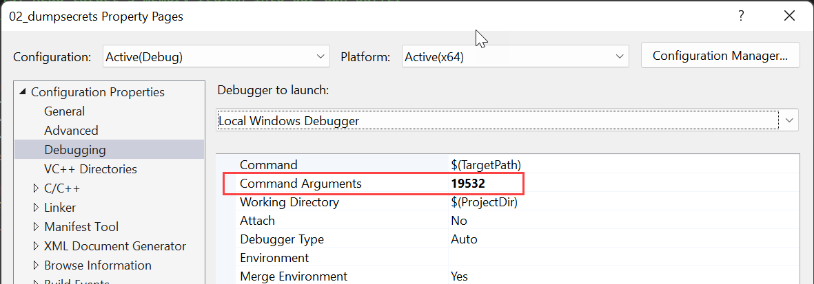
1. []Click on **OK** to close the dialog. 

You can now run the program from Visual Studio by hitting **F5** or **Debug** menu \ **Start Debugging**

You should obtain an output like presented screenshot. In this example, the console is scrolled down to the location where you can observe the text entered in notepad.
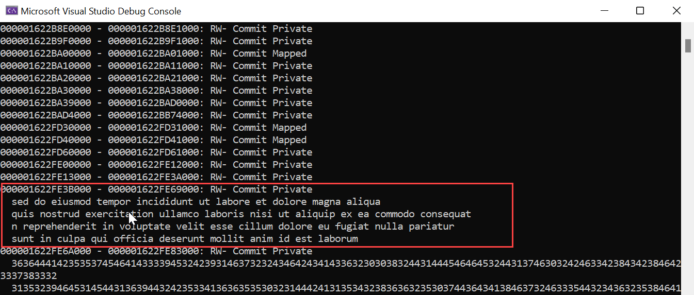

You have completed this exercise. Congratulations!

===

## Exercise 2: Implement file access control
Duration: 15 minutes  

Synopsis: In this exercise, you will implement file access control on a shared folder. You’ll work on the WIN-SRV1 machine which possesses a shared folder named Share and mapped to C:\Share.

Initially, the C:\Share folder has a permissive access control has the well-known identity Everyone has full control over the folder and child items.

---

### Task 1: Tools to manipulate file permissions

In this task, you’ll just run the common tools available to manipulate file permissions. The objective is to display current permissions on C:\Share

1. []Sign in **@lab.VirtualMachine(WIN-SRV1).SelectLink** with following credentials   
	Username: **+++NORTHWIND\Administrator+++**   
	Password: Please type the password

1. []From the **Start** menu, open a new Command Prompt as **Administrator**

1. []Run the following command:  
    ```
    icacls C:\Share
    ```

    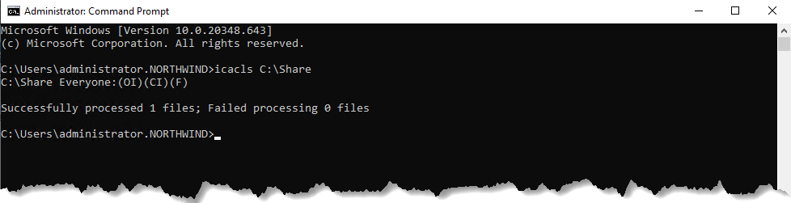

    _The icacls.exe utility is the usual way of displaying / setting permissions from the cmd environment._  

1. []From the command window, run **powershell.exe**. You are now in the Powershell environment.

1. []Run **Get-Acl C:\Share**  
    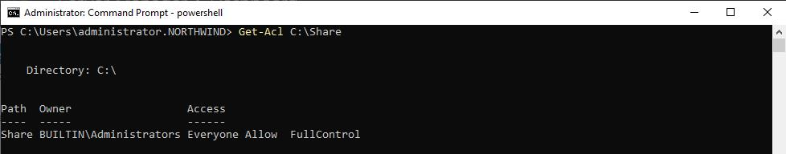

    _The Get-ACL command-let can display or set file permissions. It can also display the SDDL version of the folder security descriptor._

1. []Run **(Get-Acl C:\Share).Sddl**
    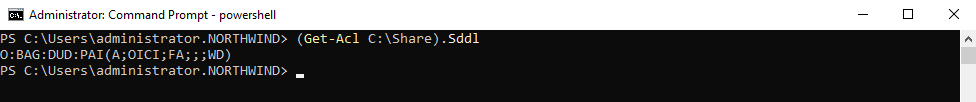

---

### Task 2: Implement file permissions

In this task, you’ll set permissions on C:\Share\Projects according to the following ruleset.

| ID#  | Folder | Policy description |
|:--|:--|:--|
|0|	C:\Share|	For the need of backup and administration, SYSTEM and WIN-SRV1\Administrators must have full control on the folder and all child files and folders.|
|1|	C:\Share\Projects\Project 1	|User NORTHWIND\david must be able to read, create and modify files. But he should not be able to delete any files.|
|2|	C:\Share\Users|	Any authenticated user should be able to list the content of this folder. But, users should not be able to browse child folder unless permissions are explicitly granted on these folders.|
|3|	C:\Share\Users|Any Authenticated user should be able to create a new child folder. Permissions for this new sub-folder should grant Full Control to SYSTEM, WIN-SRV1\Administrators and the creator.|


1. []Sign in **@lab.VirtualMachine(WIN-DC1).SelectLink** with following credentials   
	Username: **+++NORTHWIND\Administrator+++**   
	Password: Please type the password

1. []Using the course material and public documentation, set the necessary file permissions to implement the 4 rules.

---

**Evaluation**

1. Describe precisely how you implemented each rule. Make clear what change did you perform, especially regarding which user account your ACLs apply to, and which permissions did you grant.

    * To implement the requirements, the first step is to remove the *Everyone* permission on the **C:\Share** folder.

    * To implement rule 0, it is necessary to create an ACE on **C:\Share** for **SYSTEM** and **WIN-SRV1\Administrators** with these details
        * **Type** : **Allow** (this is the default)
        * **Applies to** : **This folder, subfolders and files** (this is the default)
        * **Basic permissions** area, tick the **Full control** box. This action will tick all other boxes.
        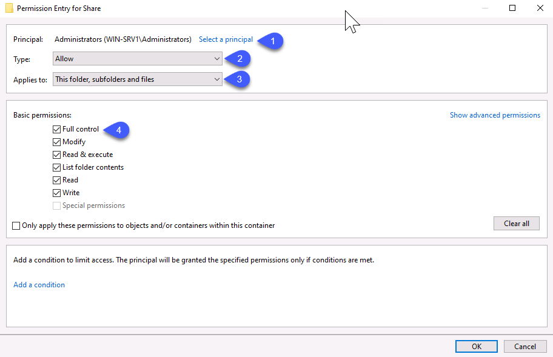  
        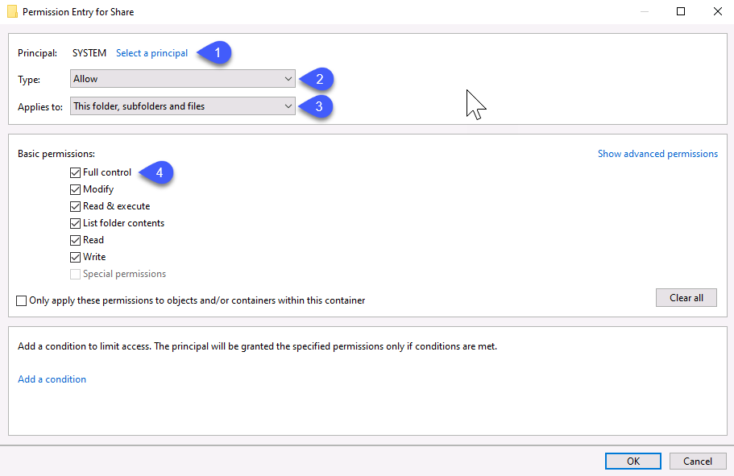

    * To implement rule 1, a new ACE for **NORTHWIND\david** must be created on **C:\Share\Projects\Project 1** with these details:
        * **Type** : **Allow** (this is the default)
        * **Applies to** : **This folder, subfolders and files** (this is the default)
        * The **Advanced permissions** area should be displayed to access all the permissions. Write permissions must be granted as pictured below with a particular attention not to grant the two **Delete** permissions, the **Change permissions** or the **Take ownership** permissions.
        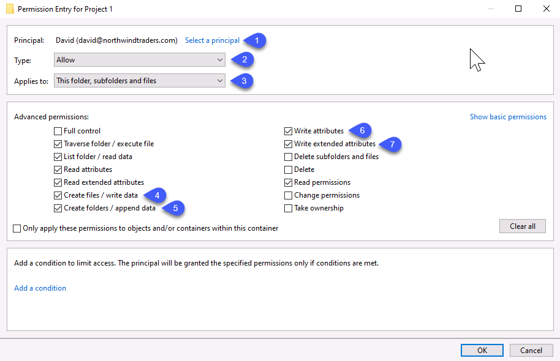

    * To implement the deletion restriction for rule 1, an additional ACE must be added. This ACE uses the **OWNER RIGHTS** special SID to override the default behavior of resource owners in Windows. Without this ACE, it is not possible to prevent a resource owner to delete one of its resources. Details are:
        * **Principal**: **OWNER RIGHTS**
        * **Type** : **Allow** (this is the default)
        * **Applies to** : **This folder, subfolders and files** (this is the default)
        * The **Advanced permissions** must have the same permissions as in the ACE for **NORTHWIND\david**
        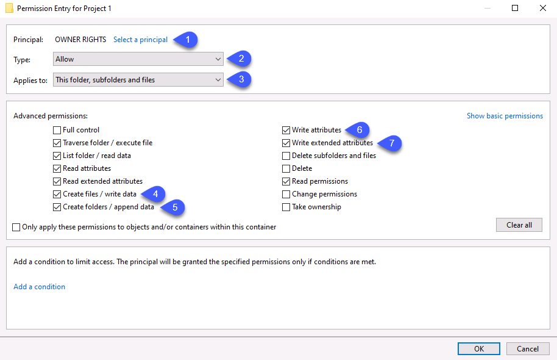

    * To implement rule 2 and 3, first step is to grant permissions to authenticated users on the **C:\Share\Users** folder to list the content and create a child folder. This is achieved by adding an ACE scoped to the folder using these details
        * **Type** : **Allow** (this is the default)
        * **Applies to** : **This folder only**
        * The **Advanced permissions** area should be displayed to access all the permissions. Standard read permissions must be granted. Additionally, the **Create folders** permission should be granted.
        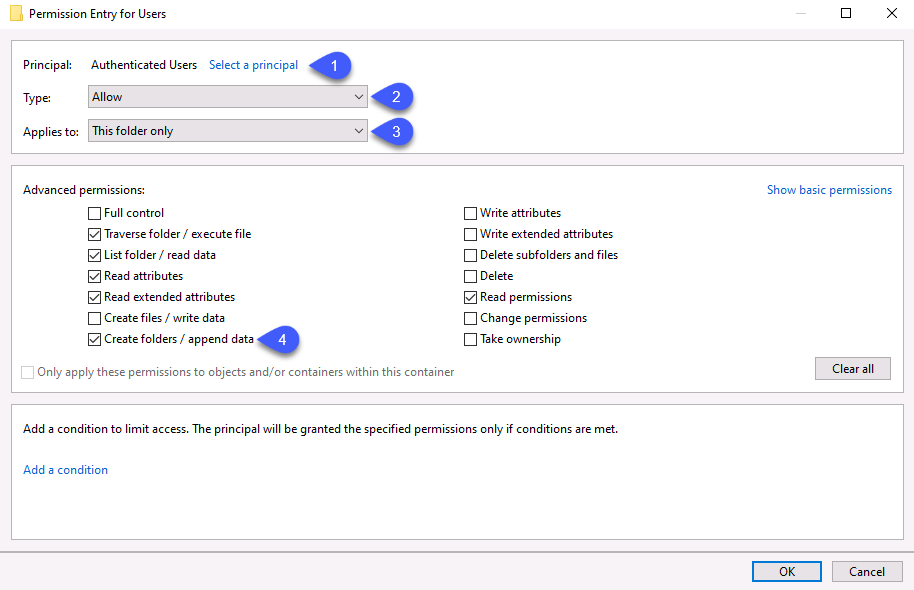

    * To complete implementation of rule 3, an additional ACE must be added to grant full control to resource owners. With permissions set previously, only Administrators and SYSTEM have access to resources in the **Users** folder. Authenticated users can create a subfolder and they will be owners of these folders. But, this is not sufficient to allow a regular and smooth access as no permissions is granted to these users. To grant permissions to the account which create the resource, a new ACE must be added for the **CREATOR OWNER** principal. Details are:
        * **Principal**: **CREATOR OWNER**
        * **Type** : **Allow** (this is the default)
        * **Applies to** : **Subfolders and files only**
        * **Basic permissions** area, tick the **Full control** box. This action will tick all other boxes.  
        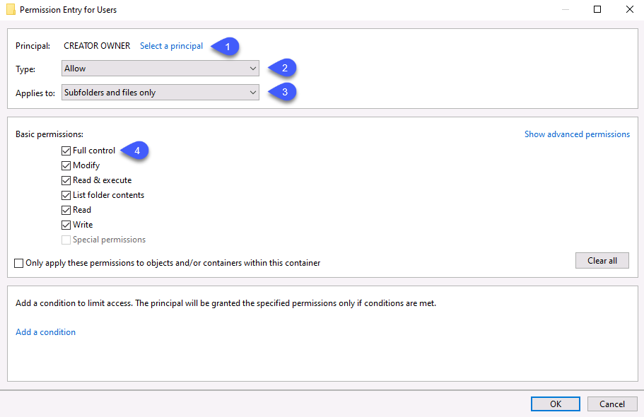

---

You have completed the implementation task. You can now move on to testing

===

### Task 3: Test permissions on the "Projects" folder
In this task, you will verify that permissions you implemented for the "Projects" folder successfully meet the requirements of the policy.

1. []Sign in **@lab.VirtualMachine(WIN-CLI1).SelectLink** with following credentials:  
    Username: **+++NORTHWIND\david+++**  
    Password: Please type the password 

1. []From file explorer, browse `\\WIN-SRV1\Share\Projects\Project 1`

1. []Try to delete the **Important Text File.txt** file

1. []As expected, you should not be able to delete the file.

1. []Create a new text file in this folder with a name you choose.

1. []If you try to delete the file you’ve just created, this will also fail. Let’s try to circumvent that limitation.

1. []Add an explicit **Full Control** permission for **NORTHWIND\david** account on the file.

1. []Now try to delete the file you’ve just created. The attempt should fail.

    >[!hint] The usual behavior in the DACL model allows users to effectively perform any operation on resources they own. You must do something special to prevent that from hapenning.

---

**Evaluation**

1. Explain the mechanism which allows to restrict permissions on files they own.

    In the Windows security model, owners have full control over the permissions of the resources they own. Users owning files or folders can edit their respective DACL and assign themselves with any of the two **Delete** permissions. To control the implicit permissions granted to resource owners, it is necessary to add a new ACE for the **OWNER RIGHTS** principal. This ACE allows controling permissions granted to the resource's owner.

---

You have completed the "Projects" testing task. You can now move on to the "Users" folder.

===

### Task 4: Test permissions on the "Users" folder
In this task, you will verify that permissions you implemented for the "Users" folder successfully meet the requirements of the policy.

1. []Sign in **@lab.VirtualMachine(WIN-CLI1).SelectLink** with following credentials:  
    Username: **+++NORTHWIND\david+++**  
    Password: Please type the password 

1. []From file explorer, browse `\\WIN-SRV1\Share\Users`

1. []Create a new text file in this folder with the name you choose. This operation should fail.

1. []Create a new folder in **Users** with the name you choose. Operation will succeed.

1. []Create a new folder with the name you choose.

1. []Now try to delete the folder you’ve just created. The attempt should succeed.

    >[!hint] If you follow the policy correctly, the only permissions you granted to regular users on "C:\Share\Users" is the right to create subfolders. That permission will inherit to child folders and files the user creates. But, child items won't have any other permissions allowing the owner to perform other operations. That is not what the policy requires. You must do something special to prevent that from hapenning.

---

**Evaluation**

1. Explain the mechanism which sets the permissions of the creator of a file or folder.

    In the Windows security model, the creator of a resource becomes its de-facto owner. While the creator can edit the permissions of the resource, it does not have any rights on it. If no inherited permissions grants the user permissions, then any further access request will be denied. Owner can circumvent this restriction by editing the DACL and add new permissions but this process is not automatic and must be performed on every resource. By adding an ACE for the **CREATOR OWNER** principal, administrators can automatically add permissions for resources creators. When this ACE is inherited, it triggers the creation of an new ACE which is the exact copy of the CREATOR OWNER ACE except the subject is replaced with the creator account. As resources are created, this ACE will define the rights creator have on them.

---

You have completed this exercise. Congratulations!