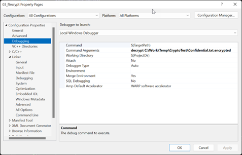
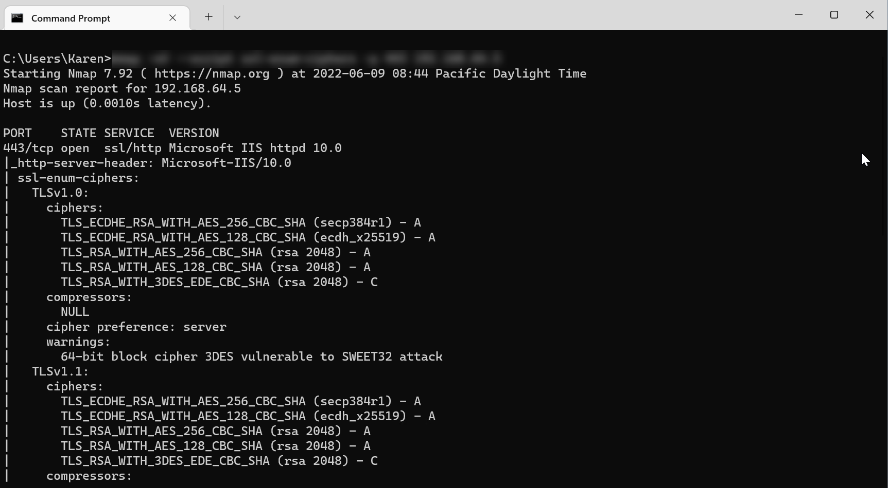
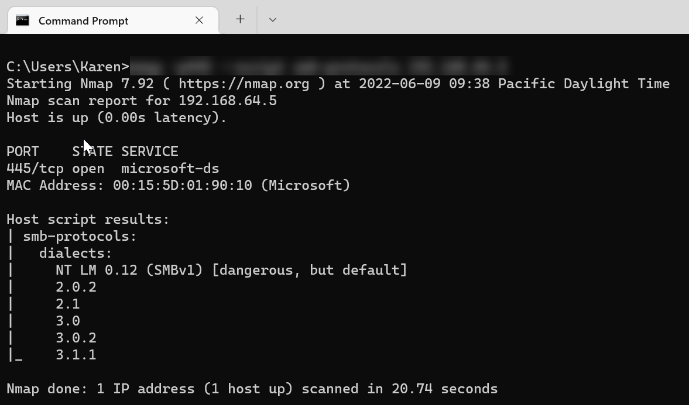
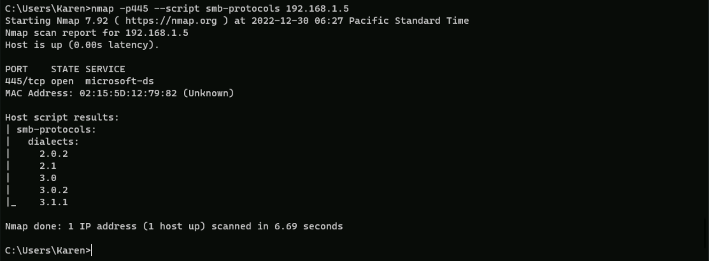
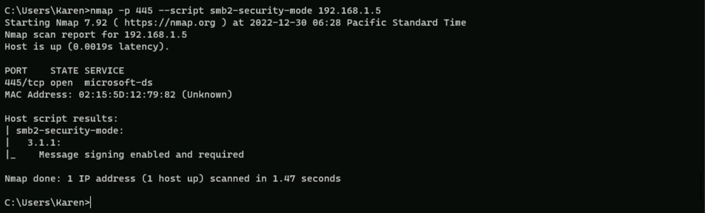

<!-- TOC -->
# Cryptography
## Abstract and learning objectives  

This training is designed to make you practice the concepts learned in the lectures.  
Learning objectives:  
- Practice Cryptographic APIs
- Configure Schannel security
- Configure SMB Encryption

## Overview 

This lab is a very simple environment consisting in a Windows 11 client and Windows Server 2022 servers. Both are members of an Active Directory domain northwindtraders.com. The server provides different services to support lab exercises. 

>[!ALERT] **DISCLAIMER**   
- Unless otherwise noted, the example companies, organizations, products, domain names, e-mail addresses, logos, people, places, and events depicted herein are fictitious, and no association with any real company, organization, product, domain name, e-mail address, logo, person, place or event is intended or should be inferred. Complying with all applicable copyright laws is the responsibility of the user. Without limiting the rights under copyright, no part of this document may be reproduced, stored in or introduced into a retrieval system, or transmitted in any form or by any means (electronic, mechanical, photocopying, recording, or otherwise), or for any purpose, without the express written permission of Microsoft Corporation.   
- Microsoft may have patents, patent applications, trademarks, copyrights, or other intellectual property rights covering subject matter in this document. Except as expressly provided in any written license agreement from Microsoft, the furnishing of this document does not give you any license to these patents, trademarks, copyrights, or other intellectual property.
- The names of manufacturers, products, or URLs are provided for informational purposes only and Microsoft makes no representations and warranties, either expressed, implied, or statutory, regarding these manufacturers or the use of the products with any Microsoft technologies. The inclusion of a manufacturer or product does not imply endorsement of Microsoft of the manufacturer or product. Links may be provided to third party sites. Such sites are not under the control of Microsoft and Microsoft is not responsible for the contents of any linked site or any link contained in a linked site, or any changes or updates to such sites. Microsoft is not responsible for webcasting or any other form of transmission received from any linked site. Microsoft is providing these links to you only as a convenience, and the inclusion of any link does not imply endorsement of Microsoft of the site or the products contained therein.

© 2022 Microsoft Corporation. All rights reserved.

Microsoft and the trademarks listed at <https://www.microsoft.com/en-us/legal/intellectualproperty/Trademarks/Usage/General.aspx> are trademarks of the Microsoft group of companies. All other trademarks are property of their respective owners.

===

## Exercise 1: Fill-in-the-gaps – code a secure file exchange tool

Duration: 60 minutes 

Synopsis: Synopsis: In this exercise, you will write a utility program which encrypts a file so that only a specified recipient can read it. The program can either work in encryption or decryption mode.

When working in encryption mode, it starts by encrypting the desired file using the AES-CBC-128 algorithm using a randomly generated key and then, encrypts that key with the public key of the recipient. The decryption mode runs this process backwards; it decrypts the encryption key using recipient’s private key and then decrypts the file.

This tool leverages the API families discussed in the lecture: Certificate store APIs, BCrypt and NCrypt. The tool is a fair representation, highly simplified, example of how encryption of content works. This will help you practice certificate and cryptographic APIs.

In this lab, NORTHWIND\david will encrypt a file and send it to NORTHWIND\alice.

### Task 1: Enroll certificates

In this task, you’ll enroll the certificate for NORTHWIND\alice and export it so that NORTHWIND\david can encrypt a message with it.

1. []Sign in **@lab.VirtualMachine(WIN-CLI1).SelectLink** with following credentials   
	- Username: **+++NORTHWIND\alice+++**  
	- Password: Please type the password 

1. []Right click the **Start** menu then, select Run. Type **certmgr.msc** and hit **Enter**.  
This will open the **Certificates - Current User** MMC console (certmgr.msc)

1. []Expand the nodes **Certificate - Current User, Personal** and **Certificates**.  
    >[!hint] _If the user does not have any certificate yet, the Certificates node won’t appear._

1. []Right-click on the **Certificates** node and select All Tasks > **Request New Certificate…**
    >[!hint] _If the Certificates node is not present, right-click the Personal node instead._

1. []On the **Before you Begin** page, click **Next**

1. []On the **Select Certificate Enrollment Policy** page, click **Next**

1. []On the **Request Certificates** page, select **WS22_User** and click **Enroll**

1. []On the **Certificate Installation Results**, you should see a status **Succeeded** if the enrollment was performed correctly. Close the wizard by clicking **Finish**.

1. []Create this folder in the filesystem: `C:\CertExport`.  
    _This folder will be used to export the certificate._

1. []Back in the **Certificate - Current User\Personal\Certificates** view, right-click on the created certificate and select **All tasks\Export**. 

1. []In the first page of the wizard, just click **Next**.

1. []In the **Export Private Key** page, select **No, do not export the private key**. Click **Next**

1. []In the **Export File Format** page, select **DER encoded binary X.509 (.CER)**. Click **Next**

1. []In the **File to Export** page, use `C:\CertExport\export.cer`

1. []In the last page, click **Finish** to perform the export.

===

### Task 2: Import the recipent's certificate and open the code project

1. []Sign in **@lab.VirtualMachine(WIN-CLI1).SelectLink** with following credentials   
	- Username: **+++NORTHWIND\david+++**  
	- Password: Please type the password

1. []Right click the **Start** menu then, select Run. Type **certmgr.msc** and hit **Enter**.  
This will open the **Certificates - Current User** MMC console (certmgr.msc)

1. []Expand the nodes **Certificate - Current User, Trusted People** and **Certificates**.  
    >[!hint] _If the user does not have any certificate yet, the Certificates node won’t appear._

1. []Right-click on the **Certificates** node and select **All Tasks** > **Import…**
    >[!hint] _If the Certificates node is not present, right-click the Trusted People node instead._

1. []On the **Welcome to the Certificate Import Wizard** page, click **Next**.

1. []On the **File to import** page, click **Browse** and select the file `C:\CertExport\export.cer`. Then, click **Next**.

1. []On the **Certificate Store** page, ensure **Place all certificates in the following store** option is selected and **Trusted People** is the selected certificate store. Then, click **Next**.

1. []On the **Completing the Certificate Import Wizard** page, click **Finish**.

You have now imported the recipient's certificate. You can proceed with opening the code project.

1. []In the `C:\Lab\WinSecLab` folder, open the WinSecLab.sln file. 

1. []VisualStudio 2022 will prompt you to sign in with your credentials. If you don't want to sign in VisualStudio, just select **Not now, maybe later**. 

1. []In the **Solution Explorer** panel, located at the right of the screen, expand the **Solution ‘WinSecLab’** node and right-click **03_filecrypt**. Then, click **Set as startup project**.

1. []In the **Solution Explorer** panel, located at the right of the screen, expand the **Solution ‘WinSecLab’ \ 03_filecrypt \ Source File** nodes and double-click on **main.cpp**.


You’re now ready to fix the code.

===
 
### Task 3: Fill missing code parts

#### Program outline
This is the basic outline of the program. Highlighted steps need fixing.
1.	Parse arguments from command line
2.	Map the source file in memory
3.	Either do the encryption or decryption based on command line argument:
    1.	Encryption case
        1.  Compute the size of encrypted content payload  
        1.  Map destination file in memory (also creates the file)  
        1.	<mark>Get a context for recipient’s certificate from its thumbprint</mark>  
        1.	Create destination file header  
        1.	Locate beginning of encrypted content in the destination file  
        1.	<mark>Encrypt content</mark>   
        1.	Get a handle to recipient’s public key  
        1.	Encrypt symmetric encryption key and put it into the header  
        1.	Compute encrypted key size  
        1.	Flush destination file’s buffer  
    1.	Decryption case
        1.	Locate file header  
        1.	Ensure file starts with a magic number  
        1.	Locate recipient’s certificate thumbprint  
        1.	<mark>Get a context for recipient’s certificate from its thumbprint</mark>    
        1.	<mark>Get a handle to recipient’s private key</mark>    
        1.	<mark>Decrypt the key material</mark>  
        1.	Compute destination file size  
        1.	Create a file mapping for the destination file.  
        1.	Locate the start of the encrypted payload in source  
        1.	<mark>Decrypt the payload</mark>  
        1.	Flush destination file’s buffer

#### API documentation
Throughout this exercise, you will have to use these APIs to fix the code:  

[CertOpenStore()](https://docs.microsoft.com/en-us/windows/win32/api/wincrypt/nf-wincrypt-certopenstore),
[CertFindCertificateInStore()](https://docs.microsoft.com/en-us/windows/win32/api/wincrypt/nf-wincrypt-certfindcertificateinstore),
[BCryptGenRandom()](https://docs.microsoft.com/en-us/windows/win32/api/bcrypt/nf-bcrypt-bcryptgenrandom),
[BCryptSetProperty()](https://docs.microsoft.com/en-us/windows/win32/api/bcrypt/nf-bcrypt-bcryptsetproperty),
[BCryptEncrypt()](https://docs.microsoft.com/en-us/windows/win32/api/bcrypt/nf-bcrypt-bcryptencrypt),
[CryptAcquireCertificatePrivateKey()](https://docs.microsoft.com/en-us/windows/win32/api/wincrypt/nf-wincrypt-cryptacquirecertificateprivatekey),
[NCryptDecrypt()](https://docs.microsoft.com/en-us/windows/win32/api/ncrypt/nf-ncrypt-ncryptdecrypt),
[BCryptDecrypt()](https://docs.microsoft.com/en-us/windows/win32/api/bcrypt/nf-bcrypt-bcryptdecrypt)

>[!help] These are public APIs from the Windows SDK. Link is provided for convenience. Should the link be broken, just search for the API name using your favorite search engine.

===

#### Fix1: Retrieve the certificate handle
**<u>What to fix</u>**
- Function **MyGetCertificateCtxFromHash()**, steps noted 2. and 3.

**<u>Functional description</u>**  
The MyGetCertificateCtxFromHash() function opens the certificate store specifed by `wszStoreName` and search for a particular certificate given by the SHA1 hash (or thumbprint).  
>[!hint] The certificate store the function tries to open is a built-in certificate store. You must ensure you use the CERT_STORE_PROV_SYSTEM provider. Also, do not forget it is a **User** certificate store.

**<u>Variables to use</u>** 
```C-nocopy
LPCWSTR         wszStoreName;           // IN: Name of the certificate store to open
LPCWSTR         wszCertHashString;      // IN: Thumbprint of the certificate (SHA1 hash)
PCCERT_CONTEXT* ppCertContext           // OUT: Pointer to the certificate context
HCERTSTORE      hCertStore = NULL;      // Handle to the certificate store
CRYPT_HASH_BLOB hashBlob = { 0 };       // Hash of the certificate
```

#### Fix2: Data encryption
**<u>What to fix</u>**
- function **MyEncryptBuffer()**, step 1., 2., 5., 7.  

**<u>Functional description</u>**  
The MyEncryptBuffer() function encrypts a data buffer using provided key material.
- Fill `rgbKey` and `rgbIV` with random bytes. These will be the symmetric encryption key and IV.

- Open a handle to the AES cryptographic algorithm and set the chaining mode to BCRYPT_CHAIN_MODE_CBC.

    >[!hint] AES only works with fixed size blocks. You need an additional algorithm to chain the blocks. We are choosing the CBC block chaining algorithm. CBC also requires an IV.

- Encrypts content at address stored in `pbInput` and stores the result at address `pbOutput`. `cbInput` and `cbOutput` respectively store the size of input and output buffers which are allocated before the function is called.

    >[!hint]
    - As content may not be aligned to block size, you must specify the BCRYPT_BLOCK_PADDING flag.
    - As the encrypted content could be smaller than the output buffer, the function outputs the encrypted buffer size to `pcbResult`.

- Stores the symetric encryption key and IV which are stored in `pKeyDesc`

**<u>Variables to use</u>** 
```C-nocopy
    PBYTE               pbInput;                        // IN: Pointer to input buffer
    DWORD               cbInput;                        // IN: Size of input buffer in bytes
    PBYTE               pbOutput;                       // IN: Pointer to output buffer
    DWORD               cbOutput;                       // IN: Size of ouput buffer in bytes
    DWORD               *pcbResult;                     // OUT: Pointer to the size of encrypted content
    PKEY_DESC           pKeyDesc;                       // IN-OUT: Pointer to the key descriptor struct (see Common.h)

    BCRYPT_ALG_HANDLE   hAlgAes = NULL;                 // Handle to the AES algorithm
    BCRYPT_KEY_HANDLE   hKey = NULL;                    // Handle to the symmetric encryption key
    BYTE                rgbKey[MY_AES_KEYSIZE_BYTES];   // Byte vector storing the encryption key
    BYTE                rgbIV[MY_AES_KEYSIZE_BYTES];    // Byte vector storing the IV
```

===

#### Fix3: Get a handle to recipient’s private key
**<u>What to fix</u>**
- Function **wmain()**, step 3b.5.  

**<u>Functional description</u>**  
Step 3b.5. of the wmain() function opens a handle to the private key corresponding to the recipient's certificate.
>[!hint] The private key is stored by a KSP, which is the most recent cryptographic key storage provider. You must ensure you obtain a NCrypt key handle (from the modern API) and not a CAPI handle (legacy API).

**<u>Variables to use</u>** 
```C-nocopy
    PCCERT_CONTEXT  pRecipientCertContext = NULL;       // Reference to the recipient's certificate 
    NCRYPT_KEY_HANDLE   hNCryptKey = NULL;              // Handle to the recipiant's private key            
    DWORD           dwKeySpec = 0;                      // KeySpec of the recipient's private key 
    BOOL            fMustFreeRecipientKey = TRUE;       // If we should free the private's key handle after use.
```

#### Fix4: Decrypt the key material
**<u>What to fix</u>**
- Function **wmain()**, step 3b.6.  

**<u>Functional description</u>**  
Step 3b.6. decrypts the symetric encryption key and IV stored in the file header pointed by `pFileHeader` using recipient's private key `hNCryptKey`. The resulting symmetric key and IV are then stored in `keyDescriptor`.
>[!hint]
- This is the symmetric operation of step 3a.8.
- Consequence: Be careful to specify the same RSA padding algorithm as when the encryption was performed.

**<u>Variables to use:</u>**  
```C-nocopy
    PFILE_HEADER    pFileHeader = NULL;                     // File header of the protected file 
    KEY_DESC        keyDescriptor = { 0 };                  // Symmetric key information
    NCRYPT_KEY_HANDLE   hNCryptKey = NULL;                  // Handle to the recipiant's private
```

#### <strong>Fix5: Decrypt the payload</strong>
**<u>What to fix</u>**
- Function MyDecryptBuffer(), step noted 4. 

**<u>Functional description</u>**  
The MyDecryptBuffer() function decrypts a data buffer using provided key material.

- Open a handle to the AES cryptographic algorithm and set the chaining mode to BCRYPT_CHAIN_MODE_CBC.

    >[!hint] AES only works with fixed size blocks. You need an additional algorithm to chain the blocks. We are choosing the CBC block chaining algorithm. CBC also requires an IV.

- Decrypts content at address stored in `pbInput` and stores the result at address `pbOutput`. `cbInput` and `cbOutput` respectively store the size of input and output buffers which are allocated before the function is called.

    >[!hint]
    - As content may not be aligned to block size, you must specify the BCRYPT_BLOCK_PADDING flag.
    - As the decrypted content could be smaller than the output buffer, the function outputs the encrypted buffer size to `pcbResult`.
    - Do not forget to specify the IV

**<u>Variables to use</u>** 
```C-nocopy
    PBYTE               pbInput;                        // IN: Pointer to input buffer
    DWORD               cbInput;                        // IN: Size of input buffer in bytes
    PBYTE               pbOutput;                       // IN: Pointer to output buffer
    DWORD               cbOutput;                       // IN: Size of ouput buffer in bytes
    DWORD               *pcbResult;                     // OUT: Pointer to the size of decrypted content
    PKEY_DESC           pKeyDesc;                       // IN-OUT: Pointer to the key descriptor struct (see Common.h)

    BCRYPT_KEY_HANDLE   hKey = NULL;                    // Handle to the symmetric encryption key
```

---

**Evaluation**

1. Attach main.cpp to your answer sheet.

    _Fix 1:_

    ```C
    /*
    * 2. Open user's store specified in wszStoreName
    */
    HANDLE_API_CHECK_SUCCESS(hCertStore = CertOpenStore(
        CERT_STORE_PROV_SYSTEM,
        0,
        NULL,
        CERT_SYSTEM_STORE_CURRENT_USER | CERT_STORE_OPEN_EXISTING_FLAG,
        wszStoreName));

    hashBlob.cbData = cbCertHash;
    hashBlob.pbData = rgbCertHash;

    /*
    * 3. Try to find the certificate in the store.
    */
    HANDLE_API_CHECK_SUCCESS(*ppCertContext = CertFindCertificateInStore(
        hCertStore,
        X509_ASN_ENCODING | PKCS_7_ASN_ENCODING,
        0,
        CERT_FIND_HASH,
        &hashBlob,
        NULL));
    ```

    _Fix 2:_

    ```C
    /*
    * 1. Generate a new random key
    */
    NTSTATUS_API_CHECK_SUCCESS(BCryptGenRandom(
        NULL,
        &rgbKey[0],
        sizeof(rgbKey),
        BCRYPT_USE_SYSTEM_PREFERRED_RNG
    ));

    /*
    * 2. Generate a new IV
    */
    NTSTATUS_API_CHECK_SUCCESS(BCryptGenRandom(
        NULL,
        &rgbIV[0],
        sizeof(rgbIV),
        BCRYPT_USE_SYSTEM_PREFERRED_RNG
    ));

    /*
    * 5. Set the chaining mode for AES to CBC
    */
    NTSTATUS_API_CHECK_SUCCESS(BCryptSetProperty(
        hAlgAes,
        BCRYPT_CHAINING_MODE,
        (PUCHAR)BCRYPT_CHAIN_MODE_CBC,
        sizeof(BCRYPT_CHAIN_MODE_CBC),
        0
    ));

    /*
    * 7. Encrypt the content.
    */
    NTSTATUS_API_CHECK_SUCCESS(BCryptEncrypt(
        hKey,
        pbInput,
        cbInput,
        NULL,
        rgbIV,
        sizeof(rgbIV),
        pbOutput,
        cbOutput,
        pcbResult,
        BCRYPT_BLOCK_PADDING
    ));
    ```

    _Fix 3:_

    ```C
    /*
    * 3b.5 Acquire a handle to the certificate's private key.
    */
    BOOL_API_CHECK_SUCCESS(CryptAcquireCertificatePrivateKey(
        pRecipientCertContext,
        CRYPT_ACQUIRE_ONLY_NCRYPT_KEY_FLAG | CRYPT_ACQUIRE_CACHE_FLAG | CRYPT_ACQUIRE_USE_PROV_INFO_FLAG,
        NULL,
        (HCRYPTPROV_OR_NCRYPT_KEY_HANDLE*)&hNCryptKey,
        &dwKeySpec,
        &fMustFreeRecipientKey));
    ```

    _Fix 4:_

    ```C
    /*
    * 3b.6 Decrypt the key material using the recipient's certificate.
    */
    NTSTATUS_API_CHECK_SUCCESS(NCryptDecrypt(
        hNCryptKey,
        pFileHeader->pbEncryptedRecipientBlob,
        pFileHeader->cbEncryptedRecipientBlob,
        NULL,
        (PUCHAR)&keyDescriptor,
        sizeof(KEY_DESC),
        &cbEncryptedRecipientBlobSize,
        BCRYPT_PAD_PKCS1));
    ```

    _Fix 5:_
    
    ```C
    /*
    * 4. Decrypt the content.
    */
    NTSTATUS_API_CHECK_SUCCESS(BCryptDecrypt(
        hKey,
        pbInput,
        cbInput,
        NULL,
        pKeyDesc->rgbIV,
        sizeof(pKeyDesc->rgbIV),
        pbOutput,
        cbOutput,
        pcbResult,
        BCRYPT_BLOCK_PADDING
    ));
    ```

---

You have now completed the task. At this stage, your application should be ready to run. You can move on to next task to test it.

===

### Task 3: Run your program

If you filled in the blanks correctly, you should be able to compile your program (CTRL-B or **Build** menu \ **Build 03_filecrypt**) and run it.

After the application has been built, you can run it from a command-line prompt. But, running the app from VisualStudio allows you to debug it in case you made a mistake. But, before you can run the program inside Visual Studio, you need to set the command line. There are 2 ways of running the program depending on the scenario you want to test:
- Encryption mode:

    ```-nocopy
    03_filecrypt.exe encrypt path_to_file certificate_thumbprint
    ```
- Decryption mode:

    ```-nocopy
    03_filecrypt.exe decrypt path_to_file
    ```

1. []In **Visual Studio**, look at the **Solution Explorer** panel and right click on **03_filecrypt** then, select **Properties**.

1. []Expand the **Configuration Properties\Debugging** nodes and enter the arguments for the **Command Arguments** setting.

    

1. []Click on **OK** to close the dialog.

You can now run the program from Visual Studio by hitting **F5** or **Debug** menu \ **Start Debugging**

You have now completed this exercise. Congratulations!

===

## Exercise 2: Strengthen TLS server configuration

Duration : 30 minutes

Synopsis: In this exercise, you will learn how to assess a Windows SChannel configuration regarding enabled protocols and cipher suite. Then, you will learn how to configure these settings to meet certain security requirements. Concerning TLS, the main security challenge is to get rid of obsolete cipher suites, algorithms, and protocol versions.

For all connection tests, you can use:

- TLS Server: win-srv1.northwindtraders.com or IP address = 192.168.64.5  
- TCP Port: 443

### Task 1: Assess the existing

In this task, you will assess the current configuration of the server (win-srv1.northwindtraders.com)

1. []Sign in **@lab.VirtualMachine(WIN-CLI1).SelectLink** with following credentials   
	- Username: **+++WIN-CLI1\karen +++**  
	- Password: Please type the password 

1. []Once the session is ready, open a command prompt ‘as administrator’. This can be achieved in two ways:  
    1. Right-click the **Start** menu and select **Windows Terminal (Admin)**  
    1. Open the **Start** menu, type **Terminal**, right click on the **Terminal** tile and select **Run as Administrator**

1. []To assess current TLS configuration of the server, you will be using the **nmap** utility. Now, take time to review the nmap script you are going to use. Documentation is located here:  
[https://nmap.org/nsedoc/scripts/ssl-enum-ciphers.html](https://nmap.org/nsedoc/scripts/ssl-enum-ciphers.html)

1. []Use the NMap command to list cipher suites and TLS versions enabled on win-srv1.northwindtraders.com

You should obtain a result similar to:


---

**Evaluation**

1. Copy-paste the command you executed to display the list of supported ciphers.

    `nmap -sV --script ssl-enum-ciphers -p 443 hostname_or_IP`

1. Is the server accepting connections for the following TLS protocol versions?
    1. TLS 1.2 ?  
        Yes

    1. TLS 1.1 ?  
        Yes
    
    1. TLS 1.0 ?  
        Yes

1. Is the server accepting cipher suites containing the following algorithms?
    1. 3-DES?  
        Yes
    
    1. RC4?  
        No

    1. MD5?  
        No

    1. SHA1?  
        Yes

---

You have completed the assessment task. You can now move on to the remediation.

===

### Task 2: Remediate weak SChannel configuration

In this task, you will be learning how to configure enabled TLS protocols versions and cipher suites

1. []Sign in **@lab.VirtualMachine(WIN-SRV1).SelectLink** with following credentials   
	- Username: **+++NORTHWIND\Administrator+++**  
	- Password: Please type the password  

1. []Start Registry Editor (Regedt32.exe), and then locate the following registry key:  
`HKEY_LOCAL_MACHINE\SYSTEM\CurrentControlSet\Control\SecurityProviders\SCHANNEL`

1. []Using the course material, implement the following security requirements:
    1. The only versions of TLS allowed are 1.2 and 1.3

1. []Right-click the **Start** menu and select **Run**. Enter **gpedit.msc**. This will launch the Local Group Policy Editor.

1. []Expand the **Local Computer Policy \ Computer Configuration \ Administrative Templates \ Network \ SSL Configuration Settings** nodes

1. []Double click on **SSL Cipher Suite Order**
    >[!hint]The default value is populated in the text box. But, it is more convenient to edit if you copy-paste the value in notepad.

1. []Using the course material, implement the following security requirements:
    1. No suite containing obsolete algorithm (RC4, SHA1, MD5, 3DES, ...) or no encryption at all.
    1. No TLS session without encryption encryption.

1. []Put the list back into the GPO setting and click on **Apply** and **OK**.

1. []Restart the **WIN-SRV1** machine to apply the new settings.

---

**Evaluation**

1. Describe precisely the changes you performed in registry to disable obsolete TLS versions.

    * Start Registry Editor (Regedt32.exe), and then locate the following registry key:  
    `HKEY_LOCAL_MACHINE\SYSTEM\CurrentControlSet\Control\SecurityProviders\SCHANNEL`

    * Create a **REG_DWORD** value named **Enabled** under each of these subkeys and set the value to **0**
        - `SCHANNEL\Protocols\TLS 1.0\Client`
        - `SCHANNEL\Protocols\TLS 1.0\Server`
        - `SCHANNEL\Protocols\TLS 1.1\Client`
        - `SCHANNEL\Protocols\TLS 1.1\Server`

1. Write down the cipher suite list you put into the GPO.

    To edit the GPO locally:
    * Right-click the **Start** menu and select **Run**. Enter **gpedit.msc**. This will launch the Local Group Policy Editor.
    * Expand the **Local Computer Policy \ Computer Configuration \ Administrative Templates \ Network \ SSL Configuration Settings** nodes
    * Double click on **SSL Cipher Suite Order**
    * Set the GPO setting to **Enabled**.
    * The default value is populated in the text box. But, it is more convenient to edit if you copy-paste the value in notepad.
    * In the list of suites, remove the ones containing 3DES and SHA like TLS_RSA_WITH_3DES_EDE_CBC_SHA or WITH_NULL like TLS_PSK_WITH_NULL_SHA384.
    * Put the list back into the GPO setting and click on **Apply** and **OK**.

---

You have completed the remediation task. You can now move on to the verification.

===

### Task 3: Verify remediated configuration

In this task, you will assess the remediated configuration by running the same steps as in the first task.

1. []If not done already, sign in **@lab.VirtualMachine(WIN-CLI1).SelectLink** with following credentials   
	- Username: **+++WIN-CLI1\karen+++**  
	- Password: Please type the password 

1. []Once the session is ready, open a command prompt ‘as administrator’. This can be achieved in two ways:  
    1. Right-click the **Start** menu and select **Windows Terminal (Admin)**  
    1. Open the **Start** menu, type **Terminal**, right click on the **Terminal** tile and select **Run as Administrator**

1. []Use the same NMap command as before to list cipher suites and TLS versions enabled on win-srv1.northwindtraders.com

---

**Evaluation**

1. Copy-paste here the output of the NMap command you ran. 

    * The output should not display any TLS 1.0 or 1.1 version.
    * Cipher suites should not contain SHA nor 3DES.

---

You have now completed this exercise. Congratulations!

===

## Exercise 3: Strengthen SMB configuration

Duration: 30 minutes

Synopsis: In this exercise, you will learn how to assess a Windows SMB configuration regarding enabled protocols and support for encryption and signing. Then, you will learn how to configure these settings to meet certain security requirements. Concerning SMB, the main security challenge is to get rid of SMB1 and enforce signing and encryption

For all connection tests, you can use :

- File server: win-srv1.northwindtraders.com or IP address = 192.168.1.5  
- File share: \\\\win-srv1.northwindtraders.com\Share

### Task 1: Assess the existing

In this task, you will assess the current configuration of the server (win-srv1.northwindtraders.com)

1. []Sign in **@lab.VirtualMachine(WIN-CLI1).SelectLink** with following credentials   
	- Username: **+++WIN-CLI1\karen+++**  
	- Password: Please type the password 

1. []Once the session is ready, open a command prompt ‘as administrator’. This can be achieved in two ways:  
    1. Right-click the **Start** menu and select **Windows Terminal (Admin)**  
    1. Open the **Start** menu, type **Terminal**, right click on the **Terminal** tile and select **Run as Administrator**

1. []To assess the current SMB configuration of the server, you will be using the **nmap** utility. Now, take time to review the nmap scripts you are going to use. Documentation is located here: 
    - [https://nmap.org/nsedoc/scripts/smb-protocols.html](https://nmap.org/nsedoc/scripts/smb-protocols.html)
    - [https://nmap.org/nsedoc/scripts/smb2-security-mode.html](https://nmap.org/nsedoc/scripts/smb2-security-mode.html)

1. []Using the NMap documentation, run the necessary commands to
    1. To list SMB protocol versions offered by the server.
    1. To assess support for signing and encryption.

You should obtain a result similar to:


---

**Evaluation**

1. Copy-paste the command you executed for displaying the versions of SMB offered by the server.

    `nmap -p445 --script smb-protocols hostname_or_IP`

1. Copy-paste the command you executed for assessing the support of signing and encryption.

    The `smb2-security-mode` displays the signing policy on the server  
    `nmap -p 445 --script smb2-security-mode hostname_or_IP`

1. Is the server accepting a connection for the following SMB protocol versions?
    1. SMB 1?  
        Yes

    1. SMB 2?  
        Yes

    1. SMB 3?  
        Yes

1. Does the server support encryption?  
    No

---

You have completed the assessment task. You can now move on to the remediation.

===

### Task 2: Remediate weak SMB configuration

In this task, you will be learning how to configure enabled TLS protocols versions and cipher suites

1. []Sign in **@lab.VirtualMachine(WIN-SRV1).SelectLink** with following credentials   
	- Username: **+++NORTHWIND\Administrator+++**  
	- Password: Please type the password  

1. []Using the course material and public documentation, implement the following security requirements:
    1. Disable support for SMB 1 either by disabling the version or by removing the component.
    1. Ensure file server requires SMB signing
    1. Ensure SMB encryption is required to access the shared folder.

---

**Evaluation**

1. For each remediation step, describes precisely all the changes you performed on WIN-SRV1. Include screenshot of the settings you changed through the graphical interfaces and/or commands you ran with their output.

    * To disable SMB1, mutiple options are accepted:
        * From a Powershell command prompt

        ```PowerShell
        Set-SmbServerConfiguration -EnableSMB1Protocol $false
        ```

        * Remove the SMB1 feature either using powershell or the Server Manager GUI.
        
        ```PowerShell
        Disable-WindowsOptionalFeature -Online -FeatureName SMB1Protocol
        ```

        * Disable SMB1 through registry

        ```
        HKEY_LOCAL_MACHINE\SYSTEM\CurrentControlSet\Services\LanmanServer\Parameters
        Value Name: SMB1
        Value Type: REG_DWORD
        Value to set: 0
        ```

    * Signing is enforced by using this PowerShell command:
    
    ```PowerShell
    Set-SmbServerConfiguration -EnableSecuritySignature $true -RequireSecuritySignature $true
    ```

    * Encryption can be enabled using two different methods:

        * Encryption enabled at the share level:

        ```PowerShell
        Set-SmbShare -Name Share -EncryptData $true
        ```
        
        * Encryption enabled at the server level:

        ```PowerShell
        Set-SmbServerConfiguration -EncryptData $true
        ```
---

### Task 3: Verify the remediated configuration

In this task, you will assess the remediated configuration by running the same steps as in the first task.

1. []Sign in **@lab.VirtualMachine(WIN-CLI1).SelectLink** with following credentials   
	- Username: **+++WIN-CLI1\karen +++**  
	- Password: Please type the password 

1. []Once the session is ready, open a command prompt ‘as administrator’.

1. []Using the same commands as in the assessment task, run the necessary commands to
    1. To list SMB protocol versions offered by the server.
    1. To assess support for signing and encryption.

---

**Evaluation**

1. Copy-paste here the output of the NMap command you ran.

    * Enabled protocols

    

    * Security mode
    
    

---